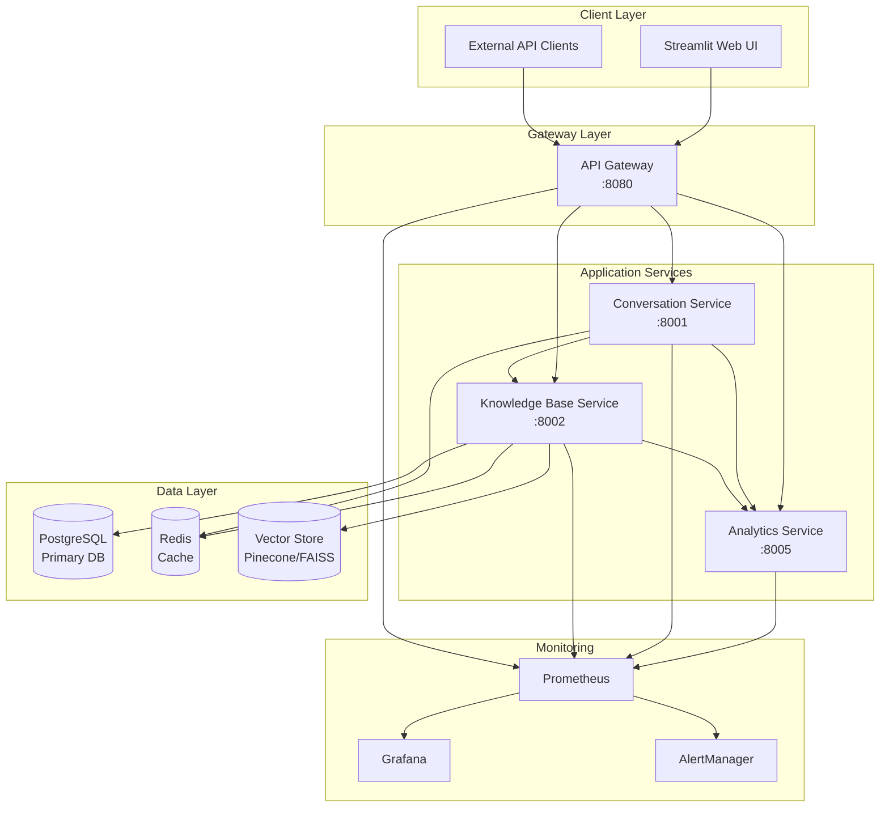
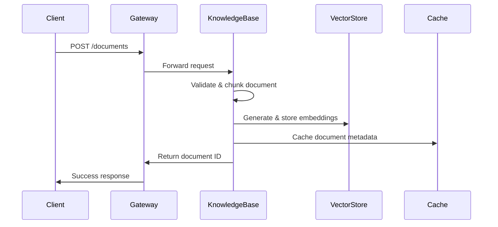
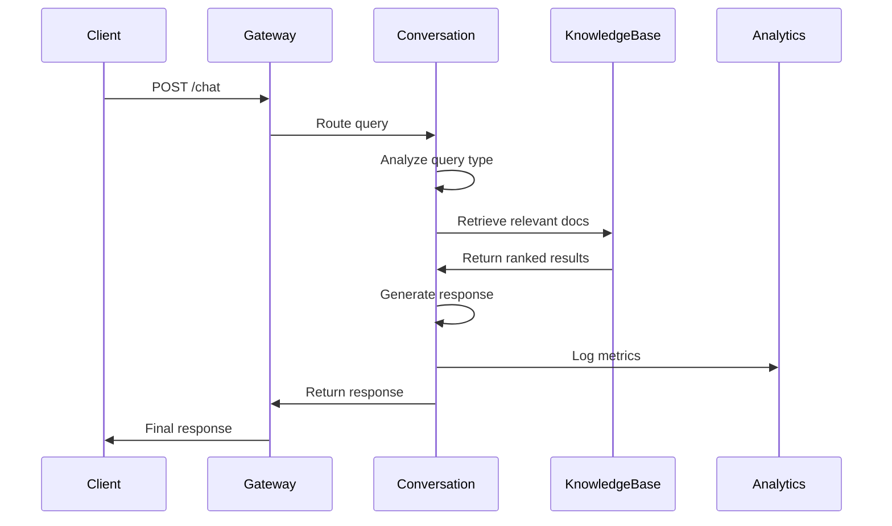

# Architecture Overview

## System Design Philosophy

The LLM-Powered Retrieval System is built on a **microservices architecture** following Domain-Driven Design (DDD) principles. Each service has a single responsibility and communicates through well-defined APIs, ensuring scalability, maintainability, and fault tolerance.

## High-Level Architecture

## Service Architecture

### 1. API Gateway Service (:8080)

**Purpose**: Central entry point providing unified API interface, routing, and cross-cutting concerns.

**Key Responsibilities**:
- Request routing and load balancing
- Rate limiting (100 req/min per client)
- Authentication and authorization
- Circuit breaker pattern
- Request/response logging
- Health check aggregation

**Technology Stack**:
- FastAPI with async/await
- Redis for rate limiting
- Prometheus metrics
- Circuit breaker implementation

### 2. Conversation Service (:8001)

**Purpose**: Core RAG engine responsible for query understanding, context management, and response generation.

**Key Components**:
- **Adaptive RAG Pipeline**: `services/conversation-service/src/core/adaptive_rag_pipeline.py:1`
- **Advanced Query Processor**: `services/conversation-service/src/core/advanced_query_processor.py:1`
- **Context Manager**: `services/conversation-service/src/core/advanced_context_manager.py:1`
- **Prompt Templates**: `services/conversation-service/src/core/prompts.py:1`

**Architecture Pattern**: Hexagonal Architecture (Ports & Adapters)

### 3. Knowledge Base Service (:8002)

**Purpose**: Document storage, indexing, retrieval, and vector operations.

**Core Capabilities**:
- Document chunking and preprocessing
- Vector embedding generation
- Semantic and hybrid search
- Document metadata management
- Cache-first retrieval strategy

**Key Files**:
- Route handlers: `services/knowledge-base-service/src/api/routes.py:1`
- Document models and schemas
- Vector store abstractions

### 4. Analytics Service (:8005)

**Purpose**: Metrics collection, quality evaluation, and system observability.

**Features**:
- Real-time quality scoring
- User feedback processing
- Performance metrics collection
- Custom dashboard data preparation

## Design Patterns

### 1. Microservices Pattern
- **Service Independence**: Each service can be deployed and scaled independently
- **Database per Service**: Each service owns its data
- **API-First Design**: Services communicate only through APIs

### 2. Circuit Breaker Pattern
- **Fault Tolerance**: Prevents cascading failures
- **Graceful Degradation**: System continues operating with reduced functionality
- **Auto-Recovery**: Automatic restoration when services recover

### 3. CQRS (Command Query Responsibility Segregation)
- **Read/Write Separation**: Optimized data access patterns
- **Eventual Consistency**: Acceptable for analytics and caching
- **Performance Optimization**: Separate models for reads and writes

### 4. Event-Driven Architecture
- **Asynchronous Processing**: Non-blocking operations
- **Loose Coupling**: Services communicate through events
- **Scalability**: Better resource utilization

## Data Flow Architecture

### Document Ingestion Flow

### Query Processing Flow

## Scalability Strategy

### Horizontal Scaling
- **Stateless Services**: All services are stateless for easy scaling
- **Load Balancing**: Kubernetes ingress with round-robin
- **Auto-scaling**: Based on CPU and memory metrics

### Vertical Scaling
- **Resource Optimization**: Memory and CPU tuning per service
- **Database Scaling**: Read replicas and connection pooling
- **Cache Optimization**: Multi-level caching strategy

### Performance Optimizations
- **Connection Pooling**: Database and external service connections
- **Async Operations**: Non-blocking I/O throughout the stack
- **Compression**: Response compression and data transfer optimization
- **CDN Integration**: Static asset delivery optimization

## Security Architecture

### Authentication & Authorization
- **JWT Tokens**: Stateless authentication
- **Role-Based Access Control**: Fine-grained permissions
- **API Key Management**: External client authentication

### Data Security
- **Encryption at Rest**: Database and vector store encryption
- **Encryption in Transit**: TLS 1.3 for all communications
- **Secrets Management**: Kubernetes secrets and env variables
- **PII Protection**: Data anonymization and retention policies

### Network Security
- **Service Mesh**: Istio for internal communication security
- **Network Policies**: Kubernetes network isolation
- **Rate Limiting**: DDoS protection and fair usage
- **Input Validation**: Comprehensive request validation

## Deployment Architecture

### Development Environment
- **Docker Compose**: Local development setup
- **Hot Reloading**: FastAPI development mode
- **Local Databases**: PostgreSQL and Redis containers

### Production Environment
- **Kubernetes**: Container orchestration
- **Helm Charts**: Deployment automation
- **Multi-zone Deployment**: High availability setup
- **Blue-Green Deployment**: Zero-downtime updates

### Monitoring & Observability
- **Metrics**: Prometheus with custom metrics
- **Logging**: Structured logging with ELK stack
- **Tracing**: Distributed tracing with Jaeger
- **Alerting**: Grafana and PagerDuty integration

## Technology Decisions

### Database Choices
- **PostgreSQL**: ACID compliance, complex queries, reliability
- **Redis**: High-performance caching, session storage
- **Vector Databases**: Specialized for embedding operations

### Framework Selection
- **FastAPI**: High performance, automatic OpenAPI, async support
- **LangChain**: LLM abstractions, prompt management
- **Pydantic**: Data validation, serialization, type safety

### Infrastructure Decisions
- **Docker**: Containerization for consistency and portability
- **Kubernetes**: Production-grade orchestration and scaling
- **Prometheus/Grafana**: Open-source monitoring stack

## Future Architecture Considerations

### Planned Enhancements
- **Multi-tenant Architecture**: Isolated data per organization
- **Event Sourcing**: Complete audit trail and replay capability
- **GraphQL Gateway**: Flexible API query capabilities
- **ML Pipeline Integration**: Model training and deployment automation

### Scalability Roadmap
- **Kafka Integration**: High-throughput event streaming
- **Elasticsearch**: Advanced search and analytics
- **ML Model Serving**: Dedicated inference services
- **Edge Computing**: Reduced latency for global users