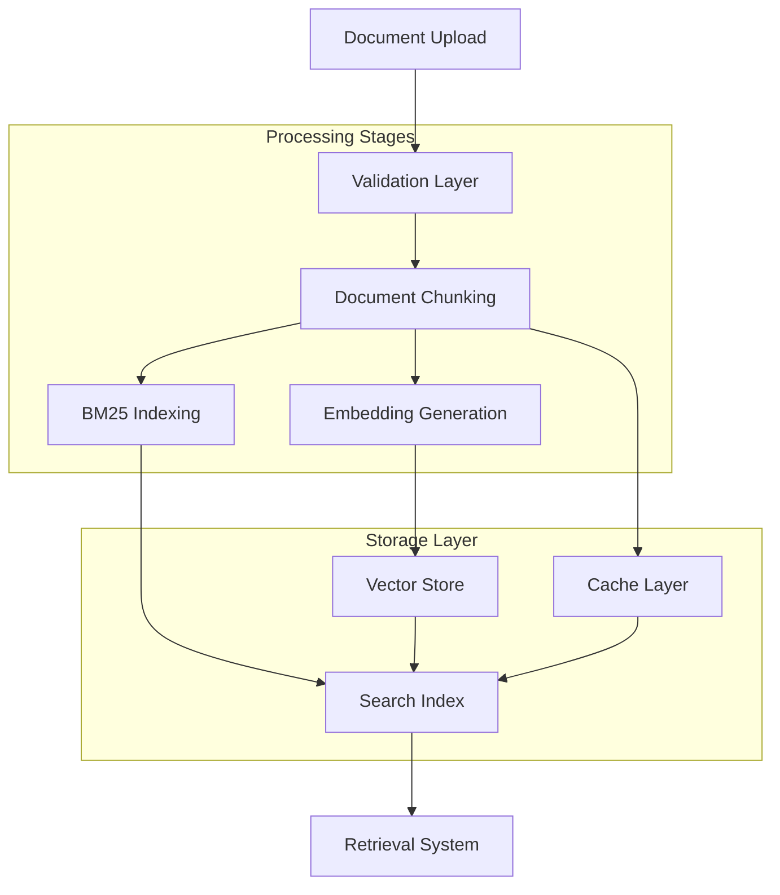

# Document Ingestion Pipeline

## Overview

The LLM-Powered Retrieval System implements a sophisticated document ingestion pipeline that transforms raw documents into searchable knowledge through multiple processing stages. The pipeline handles everything from document validation to vector embedding generation and storage, enabling intelligent document retrieval for the RAG system.

## Architecture Overview



## 1. Document Ingestion Workflow

### 1.1 Entry Points

The document ingestion pipeline supports multiple entry points through REST API endpoints:

#### Single Document Ingestion
**Endpoint**: `POST /api/v1/documents`  
**Location**: `services/knowledge-base-service/src/api/routes.py:91-170`

```python
@router.post("/documents", response_model=DocumentResponse)
async def create_document(request: DocumentCreateRequest):
    """Create a new document with full processing pipeline"""
    
    # 1. Validation
    if len(request.content.strip()) < 10:
        raise HTTPException(400, "Content must be at least 10 characters")
    
    # 2. Generate unique document ID
    document_id = str(uuid4())
    timestamp = datetime.utcnow()
    
    # 3. Process document through pipeline
    chunks = await asyncio.get_event_loop().run_in_executor(
        None, chunker.chunk_document, request.content, metadata
    )
    
    # 4. Store and index
    await store_document(document_id, request, chunks, timestamp)
```

#### Bulk Document Ingestion
**Endpoint**: `POST /api/v1/documents/bulk`  
**Location**: `services/knowledge-base-service/src/api/routes.py:532-659`

**Features**:
- Supports up to 100 documents per batch
- Partial success handling (some documents can fail)
- Asynchronous processing with progress tracking
- Individual error reporting per document

```python
@router.post("/documents/bulk")
async def create_documents_bulk(documents: List[DocumentCreateRequest]):
    """Create multiple documents with batch processing"""
    
    if len(documents) > 100:
        raise HTTPException(400, "Maximum 100 documents per batch")
    
    created_documents = []
    failed_documents = []
    
    for i, request in enumerate(documents):
        try:
            document_id = await process_single_document(request)
            created_documents.append({"id": document_id, "title": request.title})
        except Exception as e:
            failed_documents.append({
                "index": i,
                "title": request.title,
                "error": str(e)
            })
    
    return {
        "created": len(created_documents),
        "failed": len(failed_documents),
        "documents": created_documents,
        "errors": failed_documents
    }
```

### 1.2 Document Data Model

Documents must conform to the following structure:

```python
class DocumentCreateRequest(BaseModel):
    title: str = Field(..., description="Document title")
    content: str = Field(..., description="Document content (min 10 chars)")
    category: str = Field(..., description="Document category")
    subcategory: Optional[str] = Field(None, description="Document subcategory")
    tags: List[str] = Field(default=[], description="Document tags")
    metadata: Dict[str, Any] = Field(default={}, description="Additional metadata")
    
    class Config:
        schema_extra = {
            "example": {
                "title": "Docker Container Deployment Guide",
                "content": "Docker is a containerization platform that...",
                "category": "DevOps",
                "subcategory": "Containerization",
                "tags": ["docker", "containers", "deployment"],
                "metadata": {"author": "DevOps Team", "version": "2.1"}
            }
        }
```

## 2. Document Processing Stages

### 2.1 Validation Layer

**Location**: `services/knowledge-base-service/src/api/routes.py:102-106`

#### Validation Rules
- **Content Length**: Minimum 10 characters (prevents empty documents)
- **Required Fields**: title, content, category must be present
- **Batch Size**: Maximum 100 documents for bulk operations
- **Data Types**: Proper JSON structure and field types

```python
def validate_document(request: DocumentCreateRequest) -> None:
    """Comprehensive document validation"""
    
    # Content validation
    if len(request.content.strip()) < 10:
        raise HTTPException(400, "Document content too short")
    
    # Title validation
    if not request.title.strip():
        raise HTTPException(400, "Document title required")
    
    # Category validation
    if not request.category.strip():
        raise HTTPException(400, "Document category required")
    
    # Metadata size check
    if len(json.dumps(request.metadata)) > 10000:  # 10KB limit
        raise HTTPException(400, "Metadata too large")
```

### 2.2 Document Chunking

**Core Implementation**: `services/knowledge-base-service/src/core/chunking.py`

The chunking system uses a recursive character text splitting approach with semantic boundary preservation.

#### Configuration
```python
# services/shared/config.py:123-126
class KnowledgeBaseConfig(BaseConfig):
    chunk_size: int = 1000          # Characters per chunk
    chunk_overlap: int = 200        # Overlap between chunks
    chunk_strategy: str = "recursive"  # Chunking strategy
```

#### Chunking Algorithm

**1. Text Preprocessing** (`chunking.py:74-86`):
```python
def _preprocess_text(self, text: str) -> str:
    """Clean and normalize text before chunking"""
    # Remove excessive whitespace
    text = re.sub(r'\s+', ' ', text)
    
    # Normalize line breaks
    text = re.sub(r'\r\n', '\n', text)
    text = re.sub(r'\r', '\n', text)
    
    # Preserve paragraph structure
    text = re.sub(r'\n{3,}', '\n\n', text)
    
    return text.strip()
```

**2. Recursive Splitting with Hierarchical Separators** (`chunking.py:88-136`):
```python
class DocumentChunker:
    SEPARATORS = [
        r'\n\n+',          # Multiple newlines (paragraphs)
        r'\n',             # Single newlines (lines)
        r'\. ',            # Sentence endings
        r'[!?] ',          # Exclamation/question marks
        r'; ',             # Semicolons
        r', ',             # Commas
        r' '               # Spaces (words)
    ]
    
    def chunk_document(self, content: str, metadata: Dict = None) -> List[DocumentChunk]:
        """Split document into overlapping chunks with semantic boundaries"""
        
        # 1. Preprocess text
        content = self._preprocess_text(content)
        
        # 2. Try each separator in order of preference
        chunks = self._recursive_split(content, self.chunk_size)
        
        # 3. Add overlap between adjacent chunks
        overlapped_chunks = self._add_overlap(chunks, self.chunk_overlap)
        
        # 4. Create DocumentChunk objects with metadata
        return [
            DocumentChunk(
                content=chunk_content,
                chunk_id=i,
                document_id=self.current_doc_id,
                start_pos=start,
                end_pos=end,
                metadata={
                    "chunk_index": i,
                    "total_chunks": len(overlapped_chunks),
                    "character_count": len(chunk_content),
                    "word_count": len(chunk_content.split()),
                    **(metadata or {})
                }
            )
            for i, (chunk_content, start, end) in enumerate(overlapped_chunks)
        ]
```

#### Chunk Data Structure
```python
@dataclass
class DocumentChunk:
    content: str                    # Chunk text content
    chunk_id: int                  # Sequential chunk number
    document_id: str               # Parent document ID
    start_pos: int                 # Start position in original text
    end_pos: int                   # End position in original text
    metadata: Dict[str, Any]       # Chunk-specific metadata
    
    @property
    def hash(self) -> str:
        """Generate MD5 hash for deduplication"""
        return hashlib.md5(self.content.encode()).hexdigest()
    
    @property
    def word_count(self) -> int:
        """Calculate word count in chunk"""
        return len(self.content.split())
```

### 2.3 Embedding Generation

**Implementation**: `services/knowledge-base-service/src/core/semantic_retriever.py:107-130`

The system supports multiple embedding models for different use cases:

#### Supported Embedding Models
1. **Primary**: Sentence Transformers (`all-MiniLM-L6-v2`)
   - Fast, lightweight model
   - 384-dimensional embeddings
   - Good general-purpose performance

2. **Optional**: OpenAI Embeddings (`text-embedding-3-large`)
   - High-quality embeddings
   - 3072-dimensional vectors
   - Better semantic understanding

3. **Cross-Encoder**: MS MARCO MiniLM
   - Used for reranking results
   - Improved relevance scoring

#### Embedding Generation Process
```python
async def _generate_embeddings(self, document: SemanticDocument) -> None:
    """Generate embeddings for a document using multiple models"""
    
    try:
        # 1. Sentence transformer embedding (primary)
        document.embedding = self.sentence_transformer.encode(
            document.content,
            convert_to_numpy=True,
            normalize_embeddings=True  # For cosine similarity via inner product
        )
        
        # 2. OpenAI embedding (if available and configured)
        if self.openai_embeddings:
            openai_embedding = await self.openai_embeddings.aembed_query(
                document.content
            )
            document.dense_embedding = np.array(openai_embedding)
        
        # 3. Generate sparse features for hybrid search
        document.sparse_features = self._extract_sparse_features(document.content)
        
    except Exception as e:
        self.logger.error(f"Error generating embeddings for {document.id}: {e}")
        # Fallback to zero embedding
        dimension = self.sentence_transformer.get_sentence_embedding_dimension()
        document.embedding = np.zeros(dimension)
```

#### Sparse Feature Extraction
```python
def _extract_sparse_features(self, text: str) -> Dict[str, float]:
    """Extract sparse features for hybrid search"""
    
    # Tokenize and extract key terms
    words = self._tokenize(text.lower())
    word_freq = Counter(words)
    
    # Calculate TF scores
    max_freq = max(word_freq.values()) if word_freq else 1
    tf_scores = {word: freq / max_freq for word, freq in word_freq.items()}
    
    # Filter by minimum frequency and relevance
    sparse_features = {
        word: score for word, score in tf_scores.items()
        if score >= 0.1 and len(word) > 2  # Minimum relevance threshold
    }
    
    return sparse_features
```

## 3. Vector Store Integration

### 3.1 FAISS Integration (Current Implementation)

**Implementation**: `services/knowledge-base-service/src/core/semantic_retriever.py:131-151`

#### Index Configuration
```python
class FAISSVectorStore:
    def __init__(self):
        self.faiss_index = None              # Sentence transformer index
        self.openai_faiss_index = None       # OpenAI embeddings index
        self.documents = []                  # Document storage
        
    async def _rebuild_indices(self) -> None:
        """Rebuild FAISS indices when documents are added"""
        
        if not self.documents:
            return
        
        # 1. Build sentence transformer index
        embeddings = np.array([doc.embedding for doc in self.documents])
        dimension = embeddings.shape[1]
        
        # Use IndexFlatIP for normalized embeddings (cosine similarity via inner product)
        self.faiss_index = faiss.IndexFlatIP(dimension)
        self.faiss_index.add(embeddings.astype(np.float32))
        
        # 2. Build OpenAI embeddings index if available
        if self.openai_embeddings and all(doc.dense_embedding is not None for doc in self.documents):
            dense_embeddings = np.array([doc.dense_embedding for doc in self.documents])
            dense_dimension = dense_embeddings.shape[1]
            
            self.openai_faiss_index = faiss.IndexFlatIP(dense_dimension)
            self.openai_faiss_index.add(dense_embeddings.astype(np.float32))
```

#### Similarity Search
```python
async def similarity_search(self, query: str, k: int = 10) -> List[RetrievalResult]:
    """Perform semantic similarity search"""
    
    # 1. Generate query embedding
    query_embedding = self.sentence_transformer.encode(
        [query], convert_to_numpy=True, normalize_embeddings=True
    )[0]
    
    # 2. Search FAISS index
    scores, indices = self.faiss_index.search(
        query_embedding.reshape(1, -1).astype(np.float32), k
    )
    
    # 3. Create retrieval results
    results = []
    for score, idx in zip(scores[0], indices[0]):
        if idx >= 0 and idx < len(self.documents):
            document = self.documents[idx]
            results.append(RetrievalResult(
                document=document,
                semantic_score=float(score),
                keyword_score=0.0,
                hybrid_score=float(score),
                retrieval_method="semantic_faiss",
                relevance_explanation=f"Semantic similarity: {score:.3f}",
                confidence=min(float(score), 1.0)
            ))
    
    return results
```

### 3.2 Multi-Database Support Architecture

**Configuration**: `services/shared/config.py:42`

The system is designed to support multiple vector database backends:

```python
# Supported vector store types
VECTOR_STORE_TYPES = {
    "faiss": "In-memory FAISS indices",
    "pinecone": "Pinecone cloud vector database", 
    "weaviate": "Weaviate open-source vector database",
    "chromadb": "ChromaDB lightweight vector database"
}

class KnowledgeBaseConfig(BaseConfig):
    vector_store_type: str = "faiss"
    
    # Pinecone configuration
    pinecone_api_key: Optional[str] = None
    pinecone_index_name: Optional[str] = None
    pinecone_environment: str = "us-west1-gcp"
    
    # Weaviate configuration  
    weaviate_url: Optional[str] = None
    weaviate_api_key: Optional[str] = None
```

## 4. Caching Strategies and Optimization

### 4.1 Multi-Level Caching Architecture

**Implementation**: `services/knowledge-base-service/src/core/cache.py`

The caching system implements a sophisticated multi-level strategy with different TTL values for different data types:

#### Cache Types and TTL Configuration
```python
class CacheManager:
    DEFAULT_TTLS = {
        "search_results": 300,      # 5 minutes
        "document_chunks": 3600,    # 1 hour  
        "embeddings": 86400,        # 24 hours
        "rag_context": 600,         # 10 minutes
        "user_profiles": 1800       # 30 minutes
    }
```

#### 1. Search Results Caching
```python
def cache_search_results(self, query: str, filters: Dict[str, Any], 
                        results: List[Any], ttl: float = 300) -> None:
    """Cache search results with query and filter parameters"""
    
    cache_key = self._generate_key("search", {
        "query": query,
        "filters": filters,
        "timestamp_bucket": int(time.time() // 60)  # 1-minute buckets
    })
    
    self.set(cache_key, {
        "results": results,
        "result_count": len(results),
        "query_hash": hashlib.md5(query.encode()).hexdigest()
    }, ttl)
```

#### 2. Document Chunks Caching
```python
def cache_document_chunks(self, document_id: str, chunks: List[Any], 
                         ttl: float = 3600) -> None:
    """Cache processed document chunks to avoid recomputation"""
    
    cache_key = self._generate_key("chunks", document_id)
    
    self.set(cache_key, {
        "chunks": chunks,
        "chunk_count": len(chunks),
        "total_characters": sum(len(chunk.content) for chunk in chunks),
        "processing_timestamp": time.time()
    }, ttl)
```

#### 3. Embeddings Caching
```python
def cache_embeddings(self, text: str, embeddings: List[float], 
                    model_name: str = "default", ttl: float = 86400) -> None:
    """Cache expensive embedding computations"""
    
    text_hash = hashlib.sha256(text.encode()).hexdigest()
    cache_key = self._generate_key("embeddings", f"{model_name}:{text_hash}")
    
    self.set(cache_key, {
        "embeddings": embeddings,
        "text_length": len(text),
        "model_name": model_name,
        "embedding_dimension": len(embeddings)
    }, ttl)
```

### 4.2 Cache Implementation Details

#### LRU Eviction Policy
```python
class InMemoryCache:
    def __init__(self, max_size: int = 10000):
        self.cache = OrderedDict()  # LRU ordering
        self.max_size = max_size
        self.stats = {
            "hits": 0, "misses": 0, "evictions": 0,
            "memory_usage": 0, "total_requests": 0
        }
    
    def _evict_lru(self) -> None:
        """Remove least recently used entries"""
        if self.cache:
            evicted_key, evicted_entry = self.cache.popitem(last=False)
            self.stats["evictions"] += 1
            
            # Update memory usage estimate
            self.stats["memory_usage"] -= self._estimate_size(evicted_entry.value)
```

#### Cache Statistics and Monitoring
```python
def get_stats(self) -> Dict[str, Any]:
    """Get comprehensive cache performance statistics"""
    
    total_requests = self.stats["hits"] + self.stats["misses"]
    hit_rate = self.stats["hits"] / max(total_requests, 1)
    
    return {
        "hit_rate": round(hit_rate, 3),
        "total_requests": total_requests,
        "cache_size": len(self.cache),
        "max_size": self.max_size,
        "fill_percentage": round(len(self.cache) / self.max_size * 100, 1),
        "memory_usage_mb": round(self.stats["memory_usage"] / 1024 / 1024, 2),
        "evictions": self.stats["evictions"],
        "average_access_time": self._calculate_avg_access_time()
    }
```

#### Automatic Cleanup and TTL Management
```python
def cleanup_expired(self) -> int:
    """Remove expired entries and return count of removed items"""
    
    current_time = time.time()
    expired_keys = []
    
    for key, entry in self.cache.items():
        if entry.is_expired:
            expired_keys.append(key)
    
    # Remove expired entries
    for key in expired_keys:
        del self.cache[key]
    
    return len(expired_keys)
```

## 5. Bulk Document Processing

### 5.1 Bulk Processing Architecture

**Implementation**: `services/knowledge-base-service/src/api/routes.py:532-659`

The bulk processing system is designed for high-throughput document ingestion with robust error handling:

#### Processing Strategy
- **Batch Size Limit**: Maximum 100 documents per request
- **Individual Validation**: Each document validated separately
- **Partial Success Handling**: Some documents can fail without affecting others
- **Asynchronous Processing**: Non-blocking execution for better performance

```python
@router.post("/documents/bulk")
async def create_documents_bulk(documents: List[DocumentCreateRequest]):
    """Process multiple documents with comprehensive error handling"""
    
    # Validate batch size
    if len(documents) > 100:
        raise HTTPException(400, "Maximum 100 documents per batch")
    
    created_documents = []
    failed_documents = []
    
    # Process each document individually
    for i, request in enumerate(documents):
        try:
            # Individual document processing
            document_id = str(uuid4())
            timestamp = datetime.utcnow()
            
            # Validate document
            if len(request.content.strip()) < 10:
                raise ValueError("Content too short")
            
            # Process through pipeline
            chunks = await asyncio.get_event_loop().run_in_executor(
                None, chunker.chunk_document, request.content, request.metadata
            )
            
            # Store document and chunks
            document_data = {
                "id": document_id,
                "title": request.title,
                "content": request.content,
                "category": request.category,
                "subcategory": request.subcategory,
                "tags": request.tags,
                "metadata": {
                    **request.metadata,
                    "chunk_count": len(chunks),
                    "created_at": timestamp.isoformat()
                }
            }
            
            # Store in document storage
            document_storage[document_id] = document_data
            
            # Add chunks to search index
            for chunk in chunks:
                search_index.append(chunk)
            
            created_documents.append({
                "id": document_id,
                "title": request.title,
                "chunks_created": len(chunks)
            })
            
        except Exception as e:
            failed_documents.append({
                "index": i,
                "title": request.title,
                "error": str(e)
            })
    
    return {
        "status": "completed",
        "created": len(created_documents),
        "failed": len(failed_documents),
        "documents": created_documents,
        "errors": failed_documents
    }
```

### 5.2 Bulk Processing Tools

**Load Script**: `load_sample_documents.py`

The system includes a comprehensive document loading script with advanced features:

#### Features
- **Service Health Checking**: Validates service availability before processing
- **Automatic Fallback**: Falls back from bulk to individual uploads if needed
- **Progress Tracking**: Real-time progress reporting with statistics
- **Error Recovery**: Continues processing despite individual failures

```python
def bulk_upload_documents(documents: List[dict], base_url: str) -> Optional[dict]:
    """Upload documents using bulk endpoint with fallback strategy"""
    
    try:
        # Health check before processing
        health_response = requests.get(f"{base_url}/health", timeout=10)
        if health_response.status_code != 200:
            print("⚠️  Service health check failed")
            return None
        
        # Attempt bulk upload
        print(f"📤 Uploading {len(documents)} documents in bulk...")
        
        response = requests.post(
            f"{base_url}/api/v1/documents/bulk",
            json=documents,
            timeout=300  # 5 minute timeout for bulk operations
        )
        
        if response.status_code == 200:
            result = response.json()
            print(f"✅ Bulk upload successful!")
            print(f"   Created: {result['created']} documents")
            print(f"   Failed: {result['failed']} documents")
            return result
        else:
            print(f"❌ Bulk upload failed: {response.status_code}")
            return None
            
    except requests.exceptions.Timeout:
        print("⏱️  Bulk upload timeout - will try individual uploads")
        return None
    except Exception as e:
        print(f"❌ Bulk upload error: {e}")
        return None

def upload_documents_individually(documents: List[dict], base_url: str) -> dict:
    """Fallback individual document upload with progress tracking"""
    
    created = 0
    failed = 0
    errors = []
    
    for i, doc in enumerate(documents, 1):
        try:
            print(f"📄 Uploading document {i}/{len(documents)}: {doc['title'][:50]}...")
            
            response = requests.post(
                f"{base_url}/api/v1/documents",
                json=doc,
                timeout=60
            )
            
            if response.status_code == 200:
                created += 1
                print(f"   ✅ Success")
            else:
                failed += 1
                error_msg = f"HTTP {response.status_code}: {response.text[:100]}"
                errors.append({"index": i-1, "title": doc["title"], "error": error_msg})
                print(f"   ❌ Failed: {error_msg}")
                
        except Exception as e:
            failed += 1
            errors.append({"index": i-1, "title": doc["title"], "error": str(e)})
            print(f"   ❌ Error: {e}")
    
    return {"created": created, "failed": failed, "errors": errors}
```

## 6. Error Handling and Recovery Mechanisms

### 6.1 Validation Error Handling

The system implements comprehensive validation at multiple levels:

#### Document-Level Validation
```python
def validate_document_content(request: DocumentCreateRequest) -> None:
    """Comprehensive document validation with detailed error messages"""
    
    errors = []
    
    # Content validation
    if not request.content or len(request.content.strip()) < 10:
        errors.append("Document content must be at least 10 characters long")
    
    # Title validation
    if not request.title or len(request.title.strip()) < 1:
        errors.append("Document title is required")
    
    # Category validation
    if not request.category or len(request.category.strip()) < 1:
        errors.append("Document category is required")
    
    # Metadata size validation
    if len(json.dumps(request.metadata)) > 10000:  # 10KB limit
        errors.append("Document metadata exceeds 10KB limit")
    
    # Tag validation
    if len(request.tags) > 50:
        errors.append("Maximum 50 tags allowed per document")
    
    if errors:
        raise HTTPException(400, {"message": "Validation failed", "errors": errors})
```

#### Batch Processing Validation
```python
def validate_bulk_request(documents: List[DocumentCreateRequest]) -> None:
    """Validate bulk request parameters"""
    
    if len(documents) == 0:
        raise HTTPException(400, "No documents provided")
    
    if len(documents) > 100:
        raise HTTPException(400, "Maximum 100 documents per batch request")
    
    # Check for duplicate titles in batch
    titles = [doc.title for doc in documents]
    if len(titles) != len(set(titles)):
        raise HTTPException(400, "Duplicate document titles in batch")
```

### 6.2 Processing Error Recovery

#### Embedding Generation Fallback
```python
async def generate_embeddings_with_fallback(document: SemanticDocument) -> None:
    """Generate embeddings with graceful fallback handling"""
    
    try:
        # Primary embedding generation
        document.embedding = self.sentence_transformer.encode(
            document.content, convert_to_numpy=True, normalize_embeddings=True
        )
        
    except Exception as e:
        self.logger.error(f"Primary embedding generation failed for {document.id}: {e}")
        
        try:
            # Fallback to simpler embedding model
            document.embedding = self._generate_simple_embedding(document.content)
            
        except Exception as fallback_error:
            self.logger.error(f"Fallback embedding generation failed: {fallback_error}")
            
            # Ultimate fallback: zero embedding with warning
            dimension = self.sentence_transformer.get_sentence_embedding_dimension()
            document.embedding = np.zeros(dimension)
            document.metadata["embedding_warning"] = "Failed to generate embeddings"
```

#### Chunking Error Recovery
```python
def chunk_document_with_recovery(self, content: str, metadata: Dict = None) -> List[DocumentChunk]:
    """Chunk document with error recovery and fallback strategies"""
    
    try:
        # Primary chunking strategy
        return self._recursive_chunk(content, self.chunk_size, self.chunk_overlap)
        
    except Exception as e:
        self.logger.warning(f"Primary chunking failed: {e}")
        
        try:
            # Fallback: simple character-based chunking
            return self._simple_character_chunk(content, self.chunk_size)
            
        except Exception as fallback_error:
            self.logger.error(f"Fallback chunking failed: {fallback_error}")
            
            # Ultimate fallback: single chunk
            return [DocumentChunk(
                content=content,
                chunk_id=0,
                document_id=self.current_doc_id,
                start_pos=0,
                end_pos=len(content),
                metadata={
                    **(metadata or {}),
                    "chunking_warning": "Fallback to single chunk due to processing error"
                }
            )]
```

### 6.3 Service Resilience Patterns

#### Circuit Breaker for External Services
```python
class ServiceCircuitBreaker:
    def __init__(self, failure_threshold: int = 5, timeout: int = 60):
        self.failure_threshold = failure_threshold
        self.timeout = timeout
        self.failure_count = 0
        self.last_failure_time = 0
        self.state = "closed"  # closed, open, half-open
    
    async def call_with_circuit_breaker(self, func, *args, **kwargs):
        """Execute function with circuit breaker protection"""
        
        if self.state == "open":
            if time.time() - self.last_failure_time > self.timeout:
                self.state = "half-open"
            else:
                raise ServiceUnavailableError("Service circuit breaker is open")
        
        try:
            result = await func(*args, **kwargs)
            
            # Success: reset circuit breaker
            if self.state == "half-open":
                self.state = "closed"
                self.failure_count = 0
            
            return result
            
        except Exception as e:
            self.failure_count += 1
            self.last_failure_time = time.time()
            
            if self.failure_count >= self.failure_threshold:
                self.state = "open"
            
            raise e
```

## 7. Performance Optimizations and Bottlenecks

### 7.1 Current Optimizations

#### Asynchronous Processing
```python
# Concurrent chunk processing
async def process_document_async(self, request: DocumentCreateRequest) -> str:
    """Process document with asynchronous operations"""
    
    # 1. Generate document ID
    document_id = str(uuid4())
    
    # 2. Chunk document in thread pool (CPU-bound)
    chunks = await asyncio.get_event_loop().run_in_executor(
        None, 
        self.chunker.chunk_document,
        request.content,
        request.metadata
    )
    
    # 3. Generate embeddings concurrently
    embedding_tasks = [
        asyncio.create_task(self._generate_chunk_embedding(chunk))
        for chunk in chunks
    ]
    
    # 4. Store document metadata while embeddings generate
    store_task = asyncio.create_task(
        self._store_document_metadata(document_id, request)
    )
    
    # 5. Wait for all operations to complete
    await asyncio.gather(*embedding_tasks, store_task)
    
    return document_id
```

#### Batch Embedding Generation
```python
async def generate_batch_embeddings(self, texts: List[str]) -> np.ndarray:
    """Generate embeddings for multiple texts in batch for efficiency"""
    
    # Batch process for better GPU utilization
    batch_size = 32
    all_embeddings = []
    
    for i in range(0, len(texts), batch_size):
        batch_texts = texts[i:i + batch_size]
        
        # Generate embeddings for batch
        batch_embeddings = await asyncio.get_event_loop().run_in_executor(
            None,
            lambda: self.sentence_transformer.encode(
                batch_texts,
                convert_to_numpy=True,
                normalize_embeddings=True,
                batch_size=batch_size
            )
        )
        
        all_embeddings.extend(batch_embeddings)
    
    return np.array(all_embeddings)
```

#### Index Optimization Strategies
```python
class OptimizedFAISSIndex:
    def __init__(self):
        self.index = None
        self.index_dirty = False
        self.rebuild_threshold = 100  # Rebuild after 100 additions
        self.additions_since_rebuild = 0
    
    async def add_documents(self, documents: List[SemanticDocument]) -> None:
        """Add documents with intelligent index rebuilding"""
        
        # Add to document storage
        self.documents.extend(documents)
        self.additions_since_rebuild += len(documents)
        
        # Rebuild index if threshold reached
        if self.additions_since_rebuild >= self.rebuild_threshold:
            await self._rebuild_index()
            self.additions_since_rebuild = 0
        else:
            # Mark index as dirty for lazy rebuilding
            self.index_dirty = True
    
    async def search(self, query_embedding: np.ndarray, k: int) -> List[RetrievalResult]:
        """Search with lazy index rebuilding"""
        
        # Rebuild index if dirty
        if self.index_dirty:
            await self._rebuild_index()
            self.index_dirty = False
        
        # Perform search
        scores, indices = self.index.search(query_embedding.reshape(1, -1), k)
        return self._create_results(scores[0], indices[0])
```

### 7.2 Identified Bottlenecks

#### Memory Usage Bottlenecks
1. **In-Memory Document Storage**: All documents and chunks stored in memory
2. **FAISS Index Size**: Complete vector indices loaded in memory
3. **No Data Compression**: Raw text and embeddings without optimization
4. **Cache Memory Growth**: Unbounded cache growth in some scenarios

#### Processing Bottlenecks
1. **Synchronous Embedding Generation**: Blocks request processing
2. **Complete Index Rebuilding**: Expensive operation on each document addition
3. **No Batch Processing**: Individual document processing instead of batching
4. **Single-Threaded Chunking**: Text processing not parallelized

#### I/O Bottlenecks
1. **No Persistent Storage**: Loss of data on service restart
2. **No Database Indexing**: Linear search through document storage
3. **Cache Miss Penalties**: Expensive recomputation on cache misses

### 7.3 Performance Recommendations

#### Immediate Improvements (Low Effort, High Impact)
```python
# 1. Implement batch embedding generation
async def batch_process_documents(self, documents: List[DocumentCreateRequest]) -> List[str]:
    """Process multiple documents with shared operations"""
    
    # Extract all text content
    all_texts = []
    chunk_mappings = []
    
    for doc in documents:
        chunks = self.chunker.chunk_document(doc.content)
        chunk_texts = [chunk.content for chunk in chunks]
        all_texts.extend(chunk_texts)
        chunk_mappings.append((doc, chunks, len(chunk_texts)))
    
    # Generate all embeddings in single batch
    all_embeddings = await self.generate_batch_embeddings(all_texts)
    
    # Distribute embeddings back to chunks
    embedding_idx = 0
    document_ids = []
    
    for doc, chunks, chunk_count in chunk_mappings:
        doc_embeddings = all_embeddings[embedding_idx:embedding_idx + chunk_count]
        document_id = await self._store_document_with_embeddings(doc, chunks, doc_embeddings)
        document_ids.append(document_id)
        embedding_idx += chunk_count
    
    return document_ids

# 2. Implement incremental index updates
class IncrementalFAISSIndex:
    def __init__(self, dimension: int):
        self.index = faiss.IndexFlatIP(dimension)
        self.document_map = {}  # Maps index position to document ID
        
    def add_document(self, document_id: str, embedding: np.ndarray) -> None:
        """Add single document to index incrementally"""
        position = self.index.ntotal
        self.index.add(embedding.reshape(1, -1).astype(np.float32))
        self.document_map[position] = document_id
```

#### Medium-term Enhancements (Moderate Effort, High Impact)
1. **Persistent Vector Database Integration**
   - Migrate to Pinecone or Weaviate for production
   - Implement proper database schema and indexing
   - Add connection pooling and retry logic

2. **Distributed Processing Architecture**
   - Implement worker queue for document processing
   - Add load balancing for embedding generation
   - Implement horizontal scaling capabilities

3. **Advanced Caching Strategies**
   - Redis integration for distributed caching
   - Implement cache warming strategies  
   - Add intelligent cache eviction policies

#### Long-term Optimizations (High Effort, High Impact)
1. **GPU Acceleration**
   - CUDA support for embedding generation
   - GPU-optimized vector operations
   - Distributed GPU processing

2. **Advanced Vector Indexing**
   - HNSW (Hierarchical Navigable Small World) indices
   - Product quantization for memory efficiency
   - Approximate nearest neighbor search optimization

3. **Real-time Processing Pipeline**
   - Streaming document ingestion
   - Real-time index updates
   - Event-driven architecture with message queues

## 8. Monitoring and Observability

### 8.1 Performance Metrics

#### System Statistics Endpoint
```python
@router.get("/stats")
async def get_knowledge_base_stats():
    """Comprehensive system statistics for monitoring"""
    
    # Document statistics
    categories = {}
    total_chunks = 0
    total_characters = 0
    
    for doc in document_storage.values():
        category = doc["category"]
        categories[category] = categories.get(category, 0) + 1
        chunk_count = doc["metadata"].get("chunk_count", 0)
        total_chunks += chunk_count
        total_characters += len(doc.get("content", ""))
    
    # Cache statistics
    cache_stats = cache_manager.get_stats() if cache_manager else {}
    
    # Vector index statistics
    index_stats = {
        "total_vectors": len(search_index),
        "index_size_mb": _estimate_index_size_mb(),
        "average_vector_dimension": _get_average_vector_dimension()
    }
    
    return {
        "document_stats": {
            "total_documents": len(document_storage),
            "total_chunks": total_chunks,
            "total_characters": total_characters,
            "categories": categories,
            "average_chunks_per_document": round(total_chunks / max(len(document_storage), 1), 2),
            "average_characters_per_document": round(total_characters / max(len(document_storage), 1), 2)
        },
        "cache_stats": cache_stats,
        "index_stats": index_stats,
        "system_health": {
            "memory_usage_mb": _get_memory_usage_mb(),
            "cpu_usage_percent": _get_cpu_usage_percent(),
            "disk_usage_mb": _get_disk_usage_mb()
        },
        "timestamp": datetime.utcnow().isoformat()
    }
```

#### Cache Performance Monitoring
```python
class CacheMetrics:
    def __init__(self):
        self.hit_counter = Counter()
        self.miss_counter = Counter()
        self.eviction_counter = Counter()
        self.access_times = deque(maxlen=1000)  # Last 1000 access times
    
    def record_cache_hit(self, cache_type: str, access_time: float):
        """Record cache hit with timing"""
        self.hit_counter[cache_type] += 1
        self.access_times.append(access_time)
    
    def record_cache_miss(self, cache_type: str, computation_time: float):
        """Record cache miss with computation time"""
        self.miss_counter[cache_type] += 1
    
    def get_performance_report(self) -> Dict[str, Any]:
        """Generate comprehensive cache performance report"""
        
        total_hits = sum(self.hit_counter.values())
        total_misses = sum(self.miss_counter.values())
        total_requests = total_hits + total_misses
        
        if total_requests == 0:
            return {"status": "no_data"}
        
        hit_rate = total_hits / total_requests
        avg_access_time = sum(self.access_times) / len(self.access_times) if self.access_times else 0
        
        return {
            "overall_hit_rate": round(hit_rate, 3),
            "total_requests": total_requests,
            "total_hits": total_hits,
            "total_misses": total_misses,
            "average_access_time_ms": round(avg_access_time * 1000, 2),
            "hit_rates_by_type": {
                cache_type: round(hits / (hits + self.miss_counter[cache_type]), 3)
                for cache_type, hits in self.hit_counter.items()
            }
        }
```

### 8.2 Health Monitoring

#### Service Health Checks
```python
@router.get("/health")
async def health_check():
    """Comprehensive health check with dependency validation"""
    
    health_status = {
        "status": "healthy",
        "service": "knowledge-base-service",
        "version": "1.0.0",
        "timestamp": datetime.utcnow().isoformat(),
        "checks": {}
    }
    
    # Check document storage
    try:
        doc_count = len(document_storage)
        health_status["checks"]["document_storage"] = {
            "status": "healthy",
            "document_count": doc_count
        }
    except Exception as e:
        health_status["checks"]["document_storage"] = {
            "status": "unhealthy",
            "error": str(e)
        }
        health_status["status"] = "degraded"
    
    # Check embedding service
    try:
        test_embedding = sentence_transformer.encode(["test"], convert_to_numpy=True)
        health_status["checks"]["embedding_service"] = {
            "status": "healthy",
            "embedding_dimension": len(test_embedding[0])
        }
    except Exception as e:
        health_status["checks"]["embedding_service"] = {
            "status": "unhealthy",
            "error": str(e)
        }
        health_status["status"] = "degraded"
    
    # Check cache system
    if cache_manager:
        try:
            cache_stats = cache_manager.get_stats()
            health_status["checks"]["cache_system"] = {
                "status": "healthy",
                "hit_rate": cache_stats.get("hit_rate", 0),
                "size": cache_stats.get("size", 0)
            }
        except Exception as e:
            health_status["checks"]["cache_system"] = {
                "status": "unhealthy",
                "error": str(e)
            }
    
    return health_status
```

This comprehensive document ingestion pipeline provides a robust foundation for transforming raw documents into searchable knowledge while maintaining high performance, reliability, and observability. The system is well-architected for scaling from development to production environments.