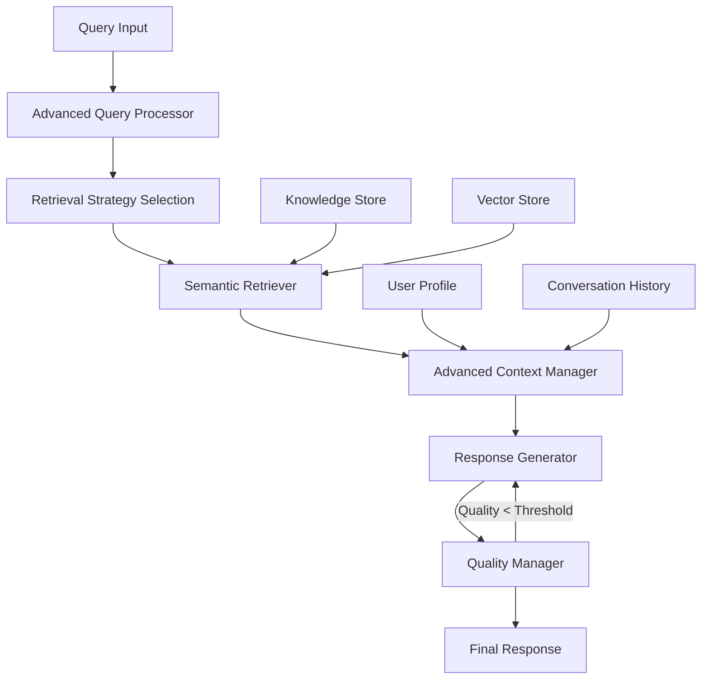

# RAG Implementation Guide

## Overview

The LLM-Powered Retrieval System implements a sophisticated Retrieval-Augmented Generation (RAG) architecture that combines advanced query processing, intelligent retrieval strategies, and comprehensive quality assurance. This document provides a detailed technical overview of the RAG implementation.

## System Architecture



## Core Components

### 1. Enhanced RAG Pipeline (`adaptive_rag_pipeline.py`)

The main orchestrator that coordinates the entire RAG process with adaptive strategies.

**Key Features:**
- **Adaptive Query Processing**: Dynamically adjusts strategies based on query characteristics
- **Multi-round Retrieval**: Performs multiple retrieval rounds for complex queries
- **Quality-driven Generation**: Ensures responses meet quality thresholds
- **Performance Optimization**: Tracks and optimizes strategy performance over time

**Core Methods:**
```python
# Main processing pipeline
async def process_query(query: str, user_id: str) -> Dict

# Strategy optimization
async def optimize_strategies() -> Dict

# Performance tracking
def get_pipeline_stats() -> Dict
```

### 2. Advanced Query Processor (`advanced_query_processor.py`)

Performs comprehensive query analysis to determine optimal processing strategies.

**Query Analysis Dimensions:**

#### Query Type Classification
- **FACTUAL**: Direct information requests
- **PROCEDURAL**: Step-by-step instructions
- **ANALYTICAL**: Analysis and reasoning tasks
- **CONVERSATIONAL**: Natural dialogue interactions
- **CLARIFICATION**: Ambiguity resolution requests
- **MULTI_HOP**: Complex reasoning chains requiring multiple steps

#### Complexity Assessment
- **SIMPLE**: Single-step, straightforward queries
- **MODERATE**: Multi-aspect queries requiring some reasoning
- **COMPLEX**: Advanced analytical or technical queries
- **MULTI_STEP**: Queries requiring sequential processing

#### Additional Analysis
- **Intent Detection**: Understanding user goals and expectations
- **Entity Extraction**: Identifying key entities and concepts
- **Query Expansion**: Generating related terms for better retrieval
- **Sentiment Analysis**: Understanding emotional context
- **Urgency Assessment**: Determining response priority

### 3. Advanced Context Manager (`advanced_context_manager.py`)

Manages intelligent context selection and optimization for enhanced response generation.

**Context Management Features:**

#### User Profile Tracking
```python
class UserProfile:
    expertise_level: str  # beginner, intermediate, expert
    interaction_patterns: Dict
    preferences: Dict
    domain_knowledge: List[str]
```

#### Conversation History Management
- **Deque-based Storage**: Efficient conversation history storage
- **Intelligent Summarization**: Automatic summarization of long conversations
- **Context Relevance Scoring**: Scoring historical context for current relevance

#### Context Optimization
- **LLM-powered Selection**: Uses language models to select most relevant context
- **Multi-source Integration**: Combines primary and supporting information
- **Confidence Scoring**: Assigns confidence scores to context pieces

### 4. Response Quality Manager (`response_quality_manager.py`)

Ensures response quality through comprehensive assessment and improvement mechanisms.

**Quality Metrics (1-5 Scale):**
- **Accuracy**: Factual correctness and information reliability
- **Completeness**: How well the response addresses all aspects of the query
- **Relevance**: Direct relationship between response and query
- **Clarity**: Structure, readability, and comprehensibility
- **Appropriateness**: Tone and style suitability for the context

**Quality Assurance Process:**
1. **Initial Assessment**: Evaluate response against all quality metrics
2. **Threshold Check**: Compare overall quality against configured threshold (default: 4.0)
3. **Improvement Loop**: If quality is below threshold, regenerate with enhanced prompts
4. **Final Validation**: Perform final quality check before delivery

### 5. Semantic Retriever (`semantic_retriever.py`)

Implements hybrid retrieval combining multiple search methodologies.

**Retrieval Methods:**
- **Semantic Search**: Using sentence transformers for meaning-based retrieval
- **Keyword Search**: BM25-based scoring for exact term matching
- **Cross-encoder Reranking**: Advanced reranking for improved relevance
- **FAISS Integration**: Fast similarity search with vector indexing

## Adaptive Strategies

### Strategy Selection Logic

The system adapts its behavior based on query characteristics:

```python
# Strategy examples
PROCEDURAL_QUERY_STRATEGY = {
    "context_window_size": 12,
    "max_retrieval_rounds": 2,
    "prefer_sequential_content": True,
    "enhance_step_by_step": True
}

ANALYTICAL_QUERY_STRATEGY = {
    "context_window_size": 8,
    "max_retrieval_rounds": 3,
    "enable_multi_perspective": True,
    "comparative_search": True
}

URGENT_QUERY_STRATEGY = {
    "context_window_size": 5,
    "max_retrieval_rounds": 1,
    "fast_mode": True,
    "simplified_processing": True
}
```

### Dynamic Parameter Adjustment

- **Context Window**: 3-12 pieces based on query complexity
- **Retrieval Rounds**: 1-3 rounds based on query type
- **Temperature**: 0.3-0.9 based on required creativity
- **Max Tokens**: 1000-4000 based on expected response length

## Prompt Engineering

### Template System (`prompts.py`)

The system uses specialized prompt templates for different query types:

```python
# Factual query template
FACTUAL_QUERY_TEMPLATE = """
Based on the provided context, answer the following factual question accurately and concisely.

Context: {context}
Question: {query}
User Profile: {user_profile}

Provide a direct, factual answer. If uncertain, state the limitations.
"""

# Analytical query template  
ANALYTICAL_QUERY_TEMPLATE = """
Using the provided context, perform a thorough analysis of the following question.

Context: {context}
Question: {query}
Analysis Requirements: {analysis_requirements}

Provide a structured analysis with reasoning, evidence, and conclusions.
"""
```

### Context Injection

Dynamic variable injection based on:
- Query characteristics
- User profile
- Conversation history
- Domain context
- Quality requirements

## Configuration Options

### Core RAG Parameters

```python
# Response Generation
max_tokens: int = 4000
temperature: float = 0.7
top_p: float = 0.9

# Retrieval Configuration
top_k: int = 5
similarity_threshold: float = 0.7
max_results: int = 10

# Context Management
context_window_size: int = 10
max_conversation_history: int = 20

# Quality Thresholds
min_quality_threshold: float = 4.0
max_improvement_attempts: int = 3
```

### Document Processing

```python
# Chunking Strategy
chunk_size: int = 1000
chunk_overlap: int = 200
max_chunks_per_doc: int = 100
min_chunk_size: int = 100

# Indexing
embedding_model: str = "all-MiniLM-L6-v2"
vector_dimension: int = 384
index_type: str = "IVF"
```

## Performance Optimization

### Caching Strategy

- **Query Embeddings**: Cache vector representations for repeated queries
- **Context Selections**: Cache optimized context for similar queries
- **Quality Assessments**: Cache quality scores for response patterns

### Strategy Learning

The system continuously learns from performance:

```python
# Performance tracking
strategy_success_rates: Dict[str, float]
average_response_times: Dict[str, float]
quality_score_history: List[Tuple[str, float]]

# Optimization triggers
def should_optimize_strategy(strategy_name: str) -> bool:
    return (
        strategy_success_rates[strategy_name] < 0.8 or
        len(quality_score_history) % 100 == 0
    )
```

### Load Balancing

- **Concurrent Processing**: Parallel retrieval and context preparation
- **Resource Management**: Dynamic allocation based on query complexity
- **Fallback Mechanisms**: Graceful degradation during high load

## API Integration

### Main Endpoints

```python
# Standard conversation
POST /chat
{
    "query": "string",
    "user_id": "string", 
    "context_options": {}
}

# Streaming responses
POST /chat/stream
{
    "query": "string",
    "user_id": "string"
}

# Pipeline statistics
GET /pipeline/stats

# Manual optimization trigger
POST /pipeline/optimize
```

### Response Format

```json
{
    "response": "Generated response text",
    "metadata": {
        "query_type": "FACTUAL",
        "complexity": "MODERATE",
        "strategy_used": "standard_factual",
        "retrieval_rounds": 2,
        "context_pieces": 8,
        "quality_scores": {
            "accuracy": 4.5,
            "completeness": 4.2,
            "relevance": 4.8,
            "clarity": 4.3,
            "appropriateness": 4.6
        },
        "processing_time_ms": 1250,
        "sources": ["doc_1", "doc_2", "doc_3"]
    }
}
```

## Error Handling

### Failure Modes and Fallbacks

```python
# LLM service failure
if llm_service_available:
    response = await llm_generate(prompt)
else:
    response = rule_based_fallback(query, context)

# Retrieval failure
if semantic_search_available:
    results = await semantic_search(query)
else:
    results = await keyword_search(query)

# Context optimization failure  
if context_optimizer_available:
    context = await optimize_context(raw_context)
else:
    context = simple_context_selection(raw_context)
```

### Quality Assurance Fallbacks

- **Rule-based Responses**: Fallback for critical service failures
- **Cached Responses**: Serving previous high-quality responses for similar queries
- **Degraded Mode**: Simplified processing when resources are constrained

## Monitoring and Analytics

### Key Metrics

- **Response Quality**: Average quality scores across all dimensions
- **Processing Time**: End-to-end latency tracking
- **Strategy Effectiveness**: Success rates per strategy type
- **User Satisfaction**: Implicit feedback through interaction patterns

### Performance Dashboards

Integration with monitoring systems:
- **Prometheus**: Metrics collection and alerting
- **Grafana**: Real-time dashboards and visualization
- **Jaeger**: Distributed tracing for request flows

## Best Practices

### Optimization Guidelines

1. **Query Classification**: Ensure accurate query type detection for optimal strategy selection
2. **Context Quality**: Focus on context relevance over quantity
3. **Response Quality**: Maintain high quality thresholds while balancing response time
4. **User Adaptation**: Continuously update user profiles based on interactions
5. **Strategy Tuning**: Regular analysis and optimization of strategy parameters

### Common Pitfalls

- **Over-contextualization**: Including too much irrelevant context
- **Strategy Rigidity**: Not adapting strategies based on performance data
- **Quality Trade-offs**: Sacrificing quality for speed without user preference consideration
- **Cache Staleness**: Not updating cached responses for evolving information

## File Locations

- **Core Pipeline**: `/services/conversation-service/src/core/adaptive_rag_pipeline.py`
- **Query Processing**: `/services/conversation-service/src/core/advanced_query_processor.py`
- **Context Management**: `/services/conversation-service/src/core/advanced_context_manager.py`
- **Quality Management**: `/services/conversation-service/src/core/response_quality_manager.py`
- **Semantic Retrieval**: `/services/knowledge-base-service/src/core/semantic_retriever.py`
- **Prompt Templates**: `/services/conversation-service/src/core/prompts.py`
- **Configuration**: `/services/shared/config.py`

---

**Next Steps**: For understanding how queries flow through this system, see [Query Processing Flow](./06-query-processing.md).