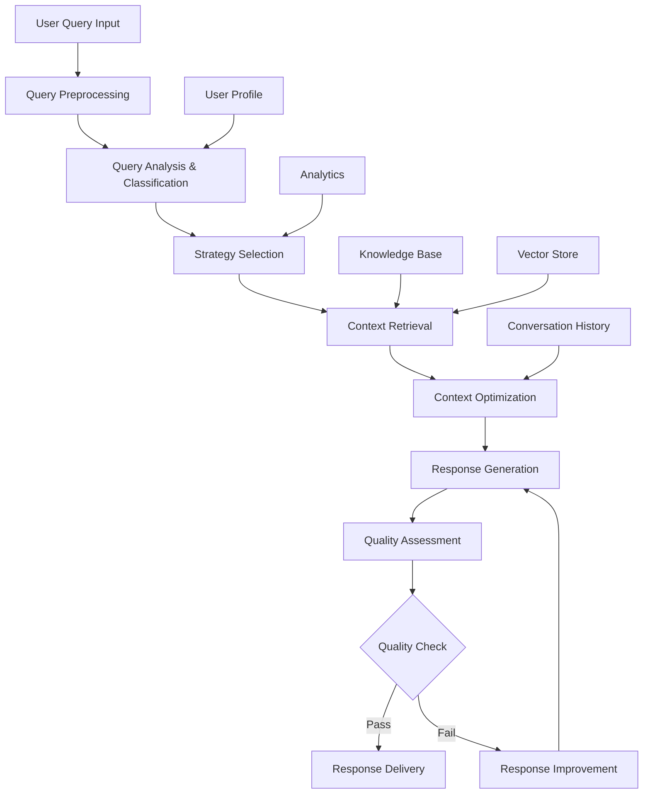

# Query Processing Flow

## Overview

The Query Processing Flow is the backbone of the LLM-Powered Retrieval System, orchestrating how user queries are analyzed, processed, and routed through the RAG pipeline. This document details the complete query lifecycle from input to response delivery.

## Flow Architecture



## Processing Stages

### Stage 1: Query Preprocessing

**Location**: `services/conversation-service/src/core/adaptive_rag_pipeline.py:85`

Initial query sanitization and preparation:

```python
async def preprocess_query(self, query: str, user_id: str) -> Dict:
    """
    Preprocess the input query before analysis
    """
    # Text normalization
    normalized_query = self._normalize_text(query)
    
    # Language detection
    language = self._detect_language(normalized_query)
    
    # Query validation
    validation_result = self._validate_query(normalized_query)
    
    return {
        "original_query": query,
        "normalized_query": normalized_query,
        "language": language,
        "is_valid": validation_result.is_valid,
        "preprocessing_metadata": {
            "character_count": len(query),
            "word_count": len(query.split()),
            "contains_special_chars": bool(re.search(r'[^\w\s]', query))
        }
    }
```

**Processing Steps:**
1. **Text Normalization**: Remove excessive whitespace, fix encoding issues
2. **Language Detection**: Identify query language for appropriate processing
3. **Query Validation**: Check for malformed inputs, injection attempts
4. **Metadata Extraction**: Capture basic query characteristics

### Stage 2: Query Analysis & Classification

**Location**: `services/conversation-service/src/core/advanced_query_processor.py:45`

Comprehensive analysis to understand query intent and characteristics:

```python
async def analyze_query(self, query: str, user_profile: UserProfile) -> QueryAnalysis:
    """
    Perform comprehensive query analysis
    """
    # Parallel analysis execution
    analysis_tasks = [
        self._classify_query_type(query),
        self._assess_complexity(query),
        self._extract_entities(query),
        self._analyze_intent(query),
        self._assess_urgency(query),
        self._detect_sentiment(query)
    ]
    
    results = await asyncio.gather(*analysis_tasks)
    
    return QueryAnalysis(
        query_type=results[0],
        complexity=results[1], 
        entities=results[2],
        intent=results[3],
        urgency=results[4],
        sentiment=results[5],
        user_context=user_profile
    )
```

#### Query Type Classification

**Six Primary Types:**

1. **FACTUAL** (`confidence > 0.8`)
   - Examples: "What is the capital of France?", "When was Python created?"
   - Characteristics: Direct information requests, specific entities

2. **PROCEDURAL** (`confidence > 0.75`)
   - Examples: "How do I install Docker?", "Steps to configure SSL"
   - Characteristics: Contains action words, sequential indicators

3. **ANALYTICAL** (`confidence > 0.7`)
   - Examples: "Compare React vs Vue", "Analyze market trends"
   - Characteristics: Comparison terms, analysis keywords

4. **CONVERSATIONAL** (`confidence > 0.6`)
   - Examples: "Tell me about your capabilities", "How are you?"
   - Characteristics: Informal tone, personal pronouns

5. **CLARIFICATION** (`confidence > 0.85`)
   - Examples: "What did you mean by...?", "Can you explain further?"
   - Characteristics: Question words about previous context

6. **MULTI_HOP** (`confidence > 0.7`)
   - Examples: "Who created the framework used by the company that..."
   - Characteristics: Multiple dependent questions, complex reasoning chains

#### Complexity Assessment

```python
def _assess_complexity(self, query: str) -> ComplexityLevel:
    """
    Assess query complexity based on multiple factors
    """
    complexity_score = 0
    
    # Linguistic complexity
    complexity_score += self._calculate_linguistic_complexity(query)
    
    # Conceptual complexity  
    complexity_score += self._assess_conceptual_depth(query)
    
    # Reasoning requirements
    complexity_score += self._assess_reasoning_requirements(query)
    
    if complexity_score < 0.3:
        return ComplexityLevel.SIMPLE
    elif complexity_score < 0.6:
        return ComplexityLevel.MODERATE  
    elif complexity_score < 0.8:
        return ComplexityLevel.COMPLEX
    else:
        return ComplexityLevel.MULTI_STEP
```

**Complexity Factors:**
- **Word Count**: Longer queries typically more complex
- **Clause Count**: Multiple clauses indicate complexity
- **Technical Terms**: Domain-specific vocabulary
- **Logical Operators**: AND, OR, NOT conditions
- **Temporal References**: Time-based requirements
- **Dependency Chains**: Questions building on previous answers

#### Entity Extraction

```python
async def _extract_entities(self, query: str) -> List[Entity]:
    """
    Extract named entities and key concepts
    """
    # Named Entity Recognition
    ner_entities = self.nlp_processor.extract_entities(query)
    
    # Domain-specific entity extraction
    domain_entities = await self._extract_domain_entities(query)
    
    # Relationship extraction
    relationships = self._extract_relationships(query, ner_entities)
    
    return self._consolidate_entities(ner_entities, domain_entities, relationships)
```

**Entity Types:**
- **PERSON**: Individual names, roles
- **ORGANIZATION**: Companies, institutions
- **LOCATION**: Places, addresses
- **TECHNOLOGY**: Tools, frameworks, languages
- **CONCEPT**: Abstract ideas, methodologies
- **TEMPORAL**: Dates, time periods

### Stage 3: Strategy Selection

**Location**: `services/conversation-service/src/core/adaptive_rag_pipeline.py:145`

Dynamic strategy selection based on query analysis:

```python
def _select_processing_strategy(self, analysis: QueryAnalysis) -> ProcessingStrategy:
    """
    Select optimal processing strategy based on query analysis
    """
    strategy_key = f"{analysis.query_type}_{analysis.complexity}"
    
    # Check for cached optimal strategies
    if strategy_key in self.strategy_cache:
        base_strategy = self.strategy_cache[strategy_key]
    else:
        base_strategy = self.default_strategies.get(
            analysis.query_type, 
            self.fallback_strategy
        )
    
    # Adaptive modifications
    modified_strategy = self._adapt_strategy(base_strategy, analysis)
    
    return modified_strategy
```

**Strategy Parameters:**

```python
# Example strategy configurations
STRATEGIES = {
    "FACTUAL_SIMPLE": {
        "context_window_size": 5,
        "max_retrieval_rounds": 1,
        "temperature": 0.3,
        "max_tokens": 1000,
        "enable_fact_checking": True
    },
    
    "PROCEDURAL_COMPLEX": {
        "context_window_size": 12,
        "max_retrieval_rounds": 2, 
        "temperature": 0.5,
        "max_tokens": 3000,
        "prefer_sequential_content": True,
        "enhance_step_by_step": True
    },
    
    "ANALYTICAL_MULTI_STEP": {
        "context_window_size": 8,
        "max_retrieval_rounds": 3,
        "temperature": 0.7,
        "max_tokens": 4000,
        "enable_multi_perspective": True,
        "reasoning_depth": "deep"
    }
}
```

### Stage 4: Context Retrieval

**Location**: `services/knowledge-base-service/src/core/semantic_retriever.py:78`

Multi-modal retrieval combining different search approaches:

```python
async def retrieve_context(
    self, 
    query: str, 
    strategy: ProcessingStrategy,
    user_profile: UserProfile
) -> List[RetrievedDocument]:
    """
    Execute context retrieval based on selected strategy
    """
    retrieval_tasks = []
    
    # Semantic search
    if strategy.enable_semantic_search:
        retrieval_tasks.append(
            self._semantic_search(query, strategy.context_window_size)
        )
    
    # Keyword search
    if strategy.enable_keyword_search:
        retrieval_tasks.append(
            self._keyword_search(query, strategy.max_results)
        )
    
    # Execute retrieval in parallel
    retrieval_results = await asyncio.gather(*retrieval_tasks)
    
    # Merge and rerank results
    merged_results = self._merge_results(retrieval_results)
    reranked_results = await self._rerank_results(query, merged_results)
    
    return reranked_results[:strategy.context_window_size]
```

**Retrieval Methods:**

1. **Semantic Search**
   ```python
   async def _semantic_search(self, query: str, top_k: int) -> List[Document]:
       # Generate query embedding
       query_embedding = await self.embedding_model.encode(query)
       
       # FAISS similarity search
       scores, indices = self.faiss_index.search(
           query_embedding.reshape(1, -1), 
           top_k * 2  # Retrieve more for reranking
       )
       
       return self._format_search_results(scores, indices)
   ```

2. **Keyword Search (BM25)**
   ```python
   def _keyword_search(self, query: str, top_k: int) -> List[Document]:
       # Tokenize query
       query_tokens = self.tokenizer.tokenize(query.lower())
       
       # BM25 scoring
       bm25_scores = self.bm25_index.get_scores(query_tokens)
       
       # Get top results
       top_indices = np.argsort(bm25_scores)[::-1][:top_k]
       
       return [self.documents[i] for i in top_indices]
   ```

3. **Cross-encoder Reranking**
   ```python
   async def _rerank_results(
       self, 
       query: str, 
       documents: List[Document]
   ) -> List[Document]:
       # Create query-document pairs
       pairs = [(query, doc.content) for doc in documents]
       
       # Cross-encoder scoring
       relevance_scores = await self.cross_encoder.predict(pairs)
       
       # Sort by relevance
       ranked_docs = sorted(
           zip(documents, relevance_scores),
           key=lambda x: x[1],
           reverse=True
       )
       
       return [doc for doc, score in ranked_docs]
   ```

### Stage 5: Context Optimization

**Location**: `services/conversation-service/src/core/advanced_context_manager.py:120`

Intelligent context selection and enhancement:

```python
async def optimize_context(
    self,
    retrieved_docs: List[Document],
    query: str,
    user_profile: UserProfile,
    conversation_history: List[Message]
) -> OptimizedContext:
    """
    Optimize context for response generation
    """
    # Context selection using LLM
    selected_context = await self._llm_context_selection(
        retrieved_docs, query, user_profile
    )
    
    # Add conversational context
    conversational_context = self._build_conversational_context(
        conversation_history, query
    )
    
    # Domain context enhancement
    domain_context = await self._enhance_domain_context(
        selected_context, user_profile.domain_expertise
    )
    
    # Final context assembly
    optimized_context = self._assemble_final_context(
        primary_context=selected_context,
        conversational_context=conversational_context,
        domain_context=domain_context,
        user_profile=user_profile
    )
    
    return optimized_context
```

**Context Optimization Techniques:**

1. **LLM-powered Selection**
   - Uses language model to select most relevant context pieces
   - Considers query intent and user expertise level
   - Filters out redundant or conflicting information

2. **Conversational Context Building**
   - Summarizes recent conversation history
   - Identifies relevant previous topics
   - Maintains context continuity

3. **Domain Context Enhancement**
   - Adds domain-specific background information
   - Includes relevant technical context
   - Adapts complexity to user expertise

### Stage 6: Response Generation

**Location**: `services/conversation-service/src/core/adaptive_rag_pipeline.py:220`

LLM-powered response generation with specialized prompts:

```python
async def generate_response(
    self,
    query: str,
    optimized_context: OptimizedContext,
    strategy: ProcessingStrategy,
    analysis: QueryAnalysis
) -> GeneratedResponse:
    """
    Generate response using optimized context and strategy
    """
    # Select appropriate prompt template
    prompt_template = self._select_prompt_template(analysis.query_type)
    
    # Construct final prompt
    final_prompt = self._construct_prompt(
        template=prompt_template,
        query=query,
        context=optimized_context,
        user_profile=analysis.user_context,
        strategy_params=strategy
    )
    
    # Generate response with LLM
    response = await self.llm_client.generate(
        prompt=final_prompt,
        temperature=strategy.temperature,
        max_tokens=strategy.max_tokens,
        top_p=strategy.top_p
    )
    
    return GeneratedResponse(
        content=response.content,
        metadata=self._extract_generation_metadata(response)
    )
```

### Stage 7: Quality Assessment

**Location**: `services/conversation-service/src/core/response_quality_manager.py:65`

Comprehensive quality evaluation across multiple dimensions:

```python
async def assess_response_quality(
    self,
    response: str,
    query: str,
    context: OptimizedContext,
    expected_quality: float = 4.0
) -> QualityAssessment:
    """
    Assess response quality across multiple dimensions
    """
    # Parallel quality assessment
    assessment_tasks = [
        self._assess_accuracy(response, context),
        self._assess_completeness(response, query),
        self._assess_relevance(response, query),
        self._assess_clarity(response),
        self._assess_appropriateness(response, query)
    ]
    
    quality_scores = await asyncio.gather(*assessment_tasks)
    
    overall_quality = np.mean(quality_scores)
    
    return QualityAssessment(
        accuracy=quality_scores[0],
        completeness=quality_scores[1],
        relevance=quality_scores[2],
        clarity=quality_scores[3],
        appropriateness=quality_scores[4],
        overall_score=overall_quality,
        meets_threshold=overall_quality >= expected_quality
    )
```

**Quality Dimensions:**

1. **Accuracy** (1-5 scale)
   - Factual correctness
   - Information reliability
   - Source attribution

2. **Completeness** (1-5 scale)
   - Addresses all query aspects
   - Sufficient detail level
   - No missing critical information

3. **Relevance** (1-5 scale)
   - Direct relationship to query
   - On-topic content
   - Avoids tangential information

4. **Clarity** (1-5 scale)
   - Structure and organization
   - Readability and comprehension
   - Logical flow

5. **Appropriateness** (1-5 scale)
   - Tone matching user context
   - Style suitability
   - Technical level appropriateness

### Stage 8: Response Improvement Loop

When quality assessment fails (overall score < threshold):

```python
async def improve_response(
    self,
    original_response: str,
    quality_assessment: QualityAssessment,
    improvement_context: Dict
) -> GeneratedResponse:
    """
    Improve response based on quality assessment feedback
    """
    # Identify specific improvement areas
    improvement_areas = self._identify_improvement_areas(quality_assessment)
    
    # Generate improvement instructions
    improvement_prompt = self._create_improvement_prompt(
        original_response=original_response,
        improvement_areas=improvement_areas,
        context=improvement_context
    )
    
    # Generate improved response
    improved_response = await self.llm_client.generate(
        prompt=improvement_prompt,
        temperature=0.5,  # Lower temperature for improvement
        max_tokens=improvement_context["strategy"].max_tokens
    )
    
    return improved_response
```

## Flow Control and Error Handling

### Async Processing Pipeline

```python
async def process_query_pipeline(
    self, 
    query: str, 
    user_id: str
) -> ProcessingResult:
    """
    Main asynchronous processing pipeline
    """
    try:
        # Stage 1: Preprocessing
        preprocessed = await self.preprocess_query(query, user_id)
        
        # Stage 2: Analysis
        analysis = await self.query_processor.analyze_query(
            preprocessed["normalized_query"],
            self.user_manager.get_profile(user_id)
        )
        
        # Stage 3: Strategy Selection
        strategy = self._select_processing_strategy(analysis)
        
        # Stage 4-5: Retrieval and Context Optimization
        context_task = self._retrieve_and_optimize_context(
            query, strategy, analysis
        )
        
        # Stage 6: Response Generation
        response_task = self._generate_response(
            query, await context_task, strategy, analysis
        )
        
        # Stage 7-8: Quality Assessment and Improvement
        final_response = await self._assess_and_improve_response(
            await response_task, query, strategy
        )
        
        return ProcessingResult(
            response=final_response,
            metadata=self._build_processing_metadata(
                analysis, strategy, context_task.result()
            )
        )
        
    except Exception as e:
        return await self._handle_processing_error(e, query, user_id)
```

### Error Handling Strategies

```python
async def _handle_processing_error(
    self, 
    error: Exception, 
    query: str, 
    user_id: str
) -> ProcessingResult:
    """
    Handle processing errors with appropriate fallbacks
    """
    error_type = type(error).__name__
    
    if error_type == "LLMServiceUnavailable":
        # Use rule-based fallback
        return await self._rule_based_fallback(query, user_id)
    
    elif error_type == "RetrievalServiceError":
        # Use cached similar responses
        return await self._cached_response_fallback(query, user_id)
    
    elif error_type == "ContextOptimizationError":
        # Use simple context selection
        return await self._simple_context_fallback(query, user_id)
    
    else:
        # Generic error response
        return self._generate_error_response(error, query)
```

## Performance Optimization

### Caching Strategy

```python
class ProcessingCache:
    """
    Multi-level caching for query processing optimization
    """
    
    def __init__(self):
        self.query_analysis_cache = TTLCache(maxsize=1000, ttl=3600)
        self.context_cache = TTLCache(maxsize=500, ttl=1800)
        self.response_cache = TTLCache(maxsize=200, ttl=7200)
    
    async def get_or_compute_analysis(
        self, 
        query: str, 
        compute_func: Callable
    ) -> QueryAnalysis:
        cache_key = hashlib.md5(query.encode()).hexdigest()
        
        if cache_key in self.query_analysis_cache:
            return self.query_analysis_cache[cache_key]
        
        analysis = await compute_func(query)
        self.query_analysis_cache[cache_key] = analysis
        return analysis
```

### Parallel Processing

```python
async def parallel_retrieval_and_context(
    self,
    query: str,
    strategy: ProcessingStrategy
) -> Tuple[List[Document], OptimizedContext]:
    """
    Execute retrieval and context preparation in parallel
    """
    # Parallel execution of independent tasks
    retrieval_task = asyncio.create_task(
        self.retriever.retrieve_context(query, strategy)
    )
    
    user_context_task = asyncio.create_task(
        self.context_manager.prepare_user_context(query)
    )
    
    # Wait for both tasks
    retrieved_docs, user_context = await asyncio.gather(
        retrieval_task, user_context_task
    )
    
    # Context optimization (depends on retrieval results)
    optimized_context = await self.context_manager.optimize_context(
        retrieved_docs, query, user_context
    )
    
    return retrieved_docs, optimized_context
```

## Monitoring and Analytics

### Processing Metrics

```python
class ProcessingMetrics:
    """
    Track and analyze query processing performance
    """
    
    def __init__(self):
        self.processing_times = defaultdict(list)
        self.quality_scores = defaultdict(list)
        self.strategy_success_rates = defaultdict(float)
    
    def record_processing_event(
        self,
        stage: str,
        duration_ms: float,
        success: bool,
        metadata: Dict
    ):
        self.processing_times[stage].append(duration_ms)
        
        if success:
            self.strategy_success_rates[metadata.get("strategy")] += 1
    
    def get_performance_summary(self) -> Dict:
        return {
            "average_processing_times": {
                stage: np.mean(times) 
                for stage, times in self.processing_times.items()
            },
            "strategy_success_rates": dict(self.strategy_success_rates),
            "quality_trends": self._analyze_quality_trends()
        }
```

### Real-time Monitoring Endpoints

```python
# Performance monitoring API
@router.get("/processing/stats")
async def get_processing_stats():
    return {
        "current_load": pipeline.get_current_load(),
        "average_response_time": pipeline.get_avg_response_time(),
        "quality_scores": pipeline.get_recent_quality_scores(),
        "strategy_distribution": pipeline.get_strategy_usage()
    }

@router.get("/processing/health")
async def processing_health_check():
    components = await pipeline.check_component_health()
    return {
        "status": "healthy" if all(components.values()) else "degraded",
        "components": components,
        "timestamp": datetime.now().isoformat()
    }
```

## Configuration Options

### Pipeline Configuration

```python
# Configuration file: services/shared/config.py
class QueryProcessingConfig:
    # Analysis settings
    enable_query_expansion: bool = True
    max_query_length: int = 2000
    supported_languages: List[str] = ["en", "es", "fr", "de"]
    
    # Strategy settings
    default_strategy: str = "adaptive"
    max_retrieval_rounds: int = 3
    context_window_range: Tuple[int, int] = (3, 15)
    
    # Quality settings
    min_quality_threshold: float = 4.0
    max_improvement_attempts: int = 3
    enable_quality_caching: bool = True
    
    # Performance settings
    max_concurrent_requests: int = 100
    request_timeout_seconds: int = 30
    enable_request_batching: bool = True
```

### Environment Variables

```bash
# Query processing environment variables
QUERY_PROCESSING_TIMEOUT=30
MAX_QUERY_LENGTH=2000
ENABLE_QUERY_CACHING=true
QUALITY_THRESHOLD=4.0
MAX_IMPROVEMENT_ROUNDS=3

# LLM settings
LLM_TEMPERATURE=0.7
LLM_MAX_TOKENS=4000
LLM_TOP_P=0.9

# Retrieval settings
RETRIEVAL_TOP_K=10
SIMILARITY_THRESHOLD=0.7
ENABLE_RERANKING=true
```

## File Locations

**Core Processing Files:**
- **Main Pipeline**: `/services/conversation-service/src/core/adaptive_rag_pipeline.py`
- **Query Processor**: `/services/conversation-service/src/core/advanced_query_processor.py`  
- **Context Manager**: `/services/conversation-service/src/core/advanced_context_manager.py`
- **Quality Manager**: `/services/conversation-service/src/core/response_quality_manager.py`
- **Semantic Retriever**: `/services/knowledge-base-service/src/core/semantic_retriever.py`

**Configuration and Utils:**
- **Configuration**: `/services/shared/config.py`
- **Prompt Templates**: `/services/conversation-service/src/core/prompts.py`
- **API Routes**: `/services/conversation-service/src/api/routes.py`

---

**Next Steps**: For details on response generation and quality assurance, see [Response Generation](./07-response-generation.md).