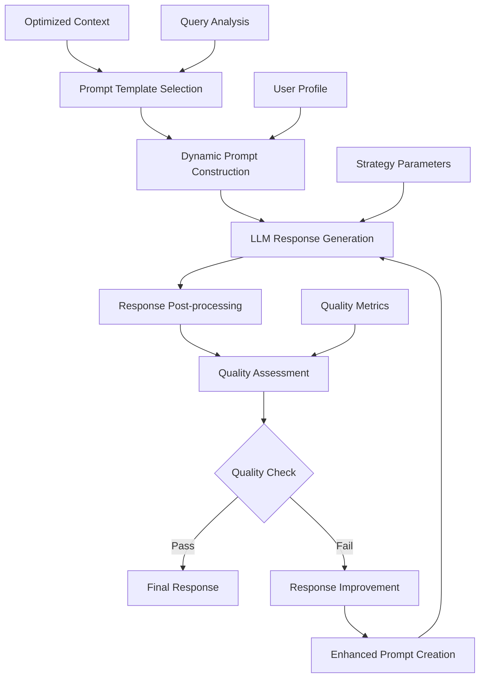

# Response Generation

## Overview

Response Generation is the final stage of the RAG pipeline where optimized context and query analysis are transformed into high-quality, contextually appropriate responses. This document details the advanced response generation system that ensures accuracy, relevance, and user satisfaction.

## Generation Architecture



## Core Components

### 1. Prompt Template System

**Location**: `services/conversation-service/src/core/prompts.py`

The system uses specialized prompt templates optimized for different query types and user contexts.

#### Template Categories

```python
class PromptTemplateManager:
    """
    Manages specialized prompt templates for different query types
    """
    
    def __init__(self):
        self.templates = {
            QueryType.FACTUAL: self._load_factual_templates(),
            QueryType.PROCEDURAL: self._load_procedural_templates(),
            QueryType.ANALYTICAL: self._load_analytical_templates(),
            QueryType.CONVERSATIONAL: self._load_conversational_templates(),
            QueryType.CLARIFICATION: self._load_clarification_templates(),
            QueryType.MULTI_HOP: self._load_multi_hop_templates()
        }
```

#### Factual Query Template

```python
FACTUAL_QUERY_TEMPLATE = """
You are an expert knowledge assistant providing accurate, factual information.

Context Information:
{context}

User Profile:
- Expertise Level: {user_expertise}
- Domain Background: {user_domain}
- Previous Interactions: {interaction_summary}

Query: {query}

Instructions:
1. Provide a direct, accurate answer based solely on the provided context
2. If information is uncertain or missing, clearly state limitations
3. Cite specific sources when making factual claims
4. Adapt technical complexity to user's expertise level
5. If no relevant information exists in context, state this clearly

Response Format:
- Start with direct answer
- Provide supporting details
- Include source references
- Note any limitations or uncertainties

Response:
"""
```

#### Procedural Query Template

```python
PROCEDURAL_QUERY_TEMPLATE = """
You are a helpful assistant specializing in clear, step-by-step instructions.

Context Information:
{context}

User Profile:
- Technical Expertise: {user_expertise}
- Domain Experience: {user_domain}
- Preferred Detail Level: {detail_preference}

Query: {query}

Instructions:
1. Break down the procedure into clear, sequential steps
2. Include prerequisites and assumptions
3. Provide warnings for critical steps
4. Adapt complexity to user's technical level
5. Include verification steps where applicable
6. Suggest alternatives if primary method fails

Response Format:
## Prerequisites
[List any requirements]

## Step-by-Step Process
1. [First step with details]
2. [Second step with details]
...

## Verification
[How to confirm success]

## Troubleshooting
[Common issues and solutions]

Response:
"""
```

#### Analytical Query Template

```python
ANALYTICAL_QUERY_TEMPLATE = """
You are an analytical expert providing comprehensive analysis and insights.

Context Information:
{context}

Analysis Requirements:
- Query Type: {query_type}
- Analysis Depth: {analysis_depth}
- User Expertise: {user_expertise}
- Comparison Needed: {needs_comparison}

Query: {query}

Instructions:
1. Provide structured analysis with clear reasoning
2. Present multiple perspectives when relevant
3. Use evidence from context to support conclusions
4. Identify limitations and assumptions
5. Suggest areas for further investigation
6. Maintain objectivity and balance

Response Format:
## Executive Summary
[Key findings and conclusions]

## Detailed Analysis
### [Aspect 1]
[Analysis with evidence]

### [Aspect 2]
[Analysis with evidence]

## Conclusions
[Summary of findings]

## Limitations
[What couldn't be analyzed]

## Recommendations
[Next steps or further investigation]

Response:
"""
```

### 2. Dynamic Prompt Construction

**Location**: `services/conversation-service/src/core/adaptive_rag_pipeline.py:175`

```python
async def construct_dynamic_prompt(
    self,
    template: str,
    query: str,
    context: OptimizedContext,
    user_profile: UserProfile,
    strategy: ProcessingStrategy,
    analysis: QueryAnalysis
) -> str:
    """
    Construct final prompt with dynamic variable injection
    """
    # Base template variables
    template_vars = {
        "query": query,
        "context": self._format_context(context),
        "user_expertise": user_profile.expertise_level,
        "user_domain": ", ".join(user_profile.domain_knowledge),
        "interaction_summary": self._summarize_interactions(user_profile)
    }
    
    # Query-specific variables
    if analysis.query_type == QueryType.PROCEDURAL:
        template_vars.update({
            "detail_preference": user_profile.preferred_detail_level,
            "step_complexity": strategy.step_complexity
        })
    
    elif analysis.query_type == QueryType.ANALYTICAL:
        template_vars.update({
            "analysis_depth": strategy.analysis_depth,
            "needs_comparison": analysis.requires_comparison,
            "reasoning_approach": strategy.reasoning_approach
        })
    
    # Context formatting based on strategy
    formatted_context = self._format_context_for_strategy(
        context, strategy, analysis
    )
    template_vars["context"] = formatted_context
    
    # Quality enhancement variables
    if strategy.enable_quality_enhancement:
        template_vars.update({
            "quality_requirements": self._get_quality_requirements(analysis),
            "response_constraints": strategy.response_constraints
        })
    
    return template.format(**template_vars)
```

#### Context Formatting Strategies

```python
def _format_context_for_strategy(
    self,
    context: OptimizedContext,
    strategy: ProcessingStrategy,
    analysis: QueryAnalysis
) -> str:
    """
    Format context based on query type and strategy
    """
    if analysis.query_type == QueryType.PROCEDURAL:
        return self._format_sequential_context(context)
    
    elif analysis.query_type == QueryType.ANALYTICAL:
        return self._format_comparative_context(context)
    
    elif analysis.query_type == QueryType.MULTI_HOP:
        return self._format_hierarchical_context(context)
    
    else:
        return self._format_standard_context(context)

def _format_sequential_context(self, context: OptimizedContext) -> str:
    """Format context to emphasize sequential information"""
    formatted_pieces = []
    
    for i, piece in enumerate(context.primary_context, 1):
        formatted_pieces.append(f"Step {i} Context:\n{piece.content}")
    
    return "\n\n".join(formatted_pieces)

def _format_comparative_context(self, context: OptimizedContext) -> str:  
    """Format context to support comparative analysis"""
    sections = {
        "Primary Information": context.primary_context,
        "Supporting Information": context.supporting_context,
        "Alternative Perspectives": context.alternative_perspectives
    }
    
    formatted_sections = []
    for section_name, pieces in sections.items():
        if pieces:
            section_content = "\n".join([p.content for p in pieces])
            formatted_sections.append(f"{section_name}:\n{section_content}")
    
    return "\n\n".join(formatted_sections)
```

### 3. LLM Response Generation

**Location**: `services/conversation-service/src/core/adaptive_rag_pipeline.py:220`

```python
async def generate_llm_response(
    self,
    final_prompt: str,
    strategy: ProcessingStrategy,
    analysis: QueryAnalysis
) -> GeneratedResponse:
    """
    Generate response using LLM with strategy-specific parameters
    """
    # Adjust generation parameters based on query type
    generation_params = self._get_generation_parameters(strategy, analysis)
    
    try:
        # Primary LLM generation
        response = await self.llm_client.generate(
            prompt=final_prompt,
            temperature=generation_params.temperature,
            max_tokens=generation_params.max_tokens,
            top_p=generation_params.top_p,
            frequency_penalty=generation_params.frequency_penalty,
            presence_penalty=generation_params.presence_penalty
        )
        
        return GeneratedResponse(
            content=response.content,
            metadata={
                "model_used": response.model,
                "tokens_used": response.usage.total_tokens,
                "generation_time": response.response_time,
                "finish_reason": response.finish_reason
            }
        )
        
    except LLMServiceException as e:
        # Fallback to alternative generation
        return await self._fallback_generation(final_prompt, strategy, e)
```

#### Generation Parameter Optimization

```python
def _get_generation_parameters(
    self,
    strategy: ProcessingStrategy,
    analysis: QueryAnalysis
) -> GenerationParameters:
    """
    Optimize generation parameters based on query characteristics
    """
    base_params = GenerationParameters(
        temperature=0.7,
        max_tokens=2000,
        top_p=0.9,
        frequency_penalty=0.0,
        presence_penalty=0.0
    )
    
    # Query type optimizations
    if analysis.query_type == QueryType.FACTUAL:
        base_params.temperature = 0.3  # Lower for factual accuracy
        base_params.frequency_penalty = 0.2  # Reduce repetition
    
    elif analysis.query_type == QueryType.ANALYTICAL:
        base_params.temperature = 0.7  # Higher for creative analysis
        base_params.max_tokens = 3000  # More space for analysis
    
    elif analysis.query_type == QueryType.CONVERSATIONAL:
        base_params.temperature = 0.8  # Natural conversation flow
        base_params.presence_penalty = 0.1  # Encourage variety
    
    # Complexity adjustments
    if analysis.complexity == ComplexityLevel.COMPLEX:
        base_params.max_tokens = min(base_params.max_tokens * 1.5, 4000)
    
    elif analysis.complexity == ComplexityLevel.SIMPLE:
        base_params.max_tokens = max(base_params.max_tokens * 0.7, 500)
    
    # User expertise adjustments
    if analysis.user_context.expertise_level == "expert":
        base_params.temperature += 0.1  # Allow more technical creativity
    
    elif analysis.user_context.expertise_level == "beginner":
        base_params.temperature -= 0.1  # More conservative responses
    
    return base_params
```

### 4. Response Post-processing

**Location**: `services/conversation-service/src/core/response_processor.py`

```python
class ResponsePostProcessor:
    """
    Post-process generated responses for quality and formatting
    """
    
    async def process_response(
        self,
        raw_response: str,
        query: str,
        context: OptimizedContext,
        analysis: QueryAnalysis
    ) -> ProcessedResponse:
        """
        Apply post-processing steps to raw LLM response
        """
        processed_response = raw_response
        
        # Apply processing steps
        processed_response = await self._clean_response(processed_response)
        processed_response = await self._format_response(
            processed_response, analysis
        )
        processed_response = await self._add_citations(
            processed_response, context
        )
        processed_response = await self._validate_response(
            processed_response, query
        )
        
        return ProcessedResponse(
            content=processed_response,
            formatting_applied=True,
            citations_added=True,
            validation_passed=True
        )
    
    async def _clean_response(self, response: str) -> str:
        """Clean up formatting and remove artifacts"""
        # Remove unwanted patterns
        cleaned = re.sub(r'\n{3,}', '\n\n', response)  # Excessive newlines
        cleaned = re.sub(r' {2,}', ' ', cleaned)       # Excessive spaces
        cleaned = cleaned.strip()
        
        # Fix common LLM artifacts
        cleaned = re.sub(r'^(Response:|Answer:)', '', cleaned)
        cleaned = re.sub(r'(Here is|Here\'s) (the|your)', '', cleaned)
        
        return cleaned
    
    async def _format_response(
        self, 
        response: str, 
        analysis: QueryAnalysis
    ) -> str:
        """Apply query-type specific formatting"""
        if analysis.query_type == QueryType.PROCEDURAL:
            return self._format_procedural_response(response)
        elif analysis.query_type == QueryType.ANALYTICAL:
            return self._format_analytical_response(response)
        else:
            return self._format_standard_response(response)
    
    def _format_procedural_response(self, response: str) -> str:
        """Format procedural responses with clear steps"""
        # Ensure numbered steps are properly formatted
        formatted = re.sub(
            r'(\d+)\.?\s*([^\n]+)', 
            r'**Step \1:** \2', 
            response
        )
        
        # Add section headers if missing
        if "Prerequisites" not in formatted and "prerequisite" in formatted.lower():
            formatted = re.sub(
                r'(prerequisite[s]?:?\s*)', 
                r'## Prerequisites\n\n', 
                formatted, 
                flags=re.IGNORECASE
            )
        
        return formatted
```

### 5. Quality Assessment and Improvement

**Location**: `services/conversation-service/src/core/response_quality_manager.py:65`

```python
class ResponseQualityManager:
    """
    Comprehensive response quality assessment and improvement
    """
    
    async def assess_and_improve_response(
        self,
        response: str,
        query: str,
        context: OptimizedContext,
        strategy: ProcessingStrategy,
        max_improvement_rounds: int = 3
    ) -> QualityAssuredResponse:
        """
        Assess response quality and improve if necessary
        """
        current_response = response
        improvement_round = 0
        
        while improvement_round < max_improvement_rounds:
            # Assess current response quality
            quality_assessment = await self._assess_response_quality(
                current_response, query, context
            )
            
            # Check if quality meets threshold
            if quality_assessment.overall_score >= strategy.quality_threshold:
                return QualityAssuredResponse(
                    content=current_response,
                    quality_assessment=quality_assessment,
                    improvement_rounds=improvement_round,
                    final_quality=quality_assessment.overall_score
                )
            
            # Generate improvement instructions
            improvement_instructions = self._generate_improvement_instructions(
                quality_assessment, query, context
            )
            
            # Improve response
            current_response = await self._improve_response(
                current_response,
                improvement_instructions,
                strategy
            )
            
            improvement_round += 1
        
        # Final assessment after max improvement rounds
        final_assessment = await self._assess_response_quality(
            current_response, query, context
        )
        
        return QualityAssuredResponse(
            content=current_response,
            quality_assessment=final_assessment,
            improvement_rounds=improvement_round,
            final_quality=final_assessment.overall_score,
            max_rounds_reached=True
        )
```

#### Quality Assessment Dimensions

```python
async def _assess_response_quality(
    self,
    response: str,
    query: str,
    context: OptimizedContext
) -> QualityAssessment:
    """
    Assess response across multiple quality dimensions
    """
    # Parallel assessment of quality dimensions
    assessment_tasks = [
        self._assess_accuracy(response, context),
        self._assess_completeness(response, query),
        self._assess_relevance(response, query),
        self._assess_clarity(response),
        self._assess_appropriateness(response, query),
        self._assess_coherence(response),
        self._assess_factual_consistency(response, context)
    ]
    
    scores = await asyncio.gather(*assessment_tasks)
    
    return QualityAssessment(
        accuracy=scores[0],
        completeness=scores[1],
        relevance=scores[2],
        clarity=scores[3],
        appropriateness=scores[4],
        coherence=scores[5],
        factual_consistency=scores[6],
        overall_score=np.mean(scores),
        detailed_feedback=self._generate_detailed_feedback(scores)
    )

async def _assess_accuracy(
    self, 
    response: str, 
    context: OptimizedContext
) -> float:
    """
    Assess factual accuracy against provided context
    """
    accuracy_prompt = f"""
    Assess the factual accuracy of this response against the provided context.
    
    Context: {context.primary_context}
    Response: {response}
    
    Rate accuracy from 1-5:
    1 = Contains significant factual errors
    2 = Some factual errors or unsupported claims
    3 = Mostly accurate with minor issues
    4 = Accurate with good context support
    5 = Highly accurate, well-supported by context
    
    Provide only the numerical score.
    """
    
    score_response = await self.llm_client.generate(
        prompt=accuracy_prompt,
        temperature=0.1,
        max_tokens=10
    )
    
    try:
        return float(re.search(r'(\d+(?:\.\d+)?)', score_response.content).group(1))
    except:
        return 3.0  # Default score if parsing fails
```

#### Response Improvement Process

```python
async def _improve_response(
    self,
    original_response: str,
    improvement_instructions: Dict[str, str],
    strategy: ProcessingStrategy
) -> str:
    """
    Generate improved response based on quality feedback
    """
    improvement_prompt = f"""
    Please improve the following response based on the specific feedback provided:

    Original Response:
    {original_response}

    Improvement Instructions:
    {self._format_improvement_instructions(improvement_instructions)}

    Requirements:
    1. Address all identified issues
    2. Maintain the core information and structure
    3. Improve clarity and organization
    4. Ensure factual accuracy
    5. Match the appropriate tone and complexity level

    Improved Response:
    """
    
    improved_response = await self.llm_client.generate(
        prompt=improvement_prompt,
        temperature=0.5,  # Moderate creativity for improvement
        max_tokens=strategy.max_tokens
    )
    
    return improved_response.content

def _generate_improvement_instructions(
    self,
    quality_assessment: QualityAssessment,
    query: str,
    context: OptimizedContext
) -> Dict[str, str]:
    """
    Generate specific improvement instructions based on quality scores
    """
    instructions = {}
    
    if quality_assessment.accuracy < 4.0:
        instructions["accuracy"] = (
            "Improve factual accuracy. Ensure all claims are supported by "
            "the provided context. Remove or qualify uncertain information."
        )
    
    if quality_assessment.completeness < 4.0:
        instructions["completeness"] = (
            "Address all aspects of the user's query. Check if any "
            "important information is missing from your response."
        )
    
    if quality_assessment.clarity < 4.0:
        instructions["clarity"] = (
            "Improve clarity and organization. Use clear headings, "
            "logical flow, and easier-to-understand language."
        )
    
    if quality_assessment.relevance < 4.0:
        instructions["relevance"] = (
            "Focus more directly on the user's specific question. "
            "Remove tangential information."
        )
    
    return instructions
```

### 6. Streaming Response Generation

**Location**: `services/conversation-service/src/api/routes.py:85`

For real-time user experience, the system supports streaming responses:

```python
@router.post("/chat/stream")
async def stream_chat_response(
    request: ChatRequest,
    background_tasks: BackgroundTasks
):
    """
    Stream response generation for real-time user experience
    """
    async def generate_stream():
        try:
            # Initialize streaming pipeline
            stream_processor = StreamingRAGPipeline()
            
            # Process query with streaming
            async for chunk in stream_processor.process_query_stream(
                query=request.query,
                user_id=request.user_id,
                stream_options=request.stream_options
            ):
                yield f"data: {json.dumps(chunk.dict())}\n\n"
            
            # Final completion marker
            yield f"data: {json.dumps({'type': 'completion', 'status': 'complete'})}\n\n"
            
        except Exception as e:
            error_chunk = {
                "type": "error",
                "error": str(e),
                "status": "failed"
            }
            yield f"data: {json.dumps(error_chunk)}\n\n"
    
    return StreamingResponse(
        generate_stream(),
        media_type="text/event-stream",
        headers={
            "Cache-Control": "no-cache",
            "Connection": "keep-alive",
            "Access-Control-Allow-Origin": "*"
        }
    )

class StreamingRAGPipeline:
    """
    Streaming version of RAG pipeline for real-time responses
    """
    
    async def process_query_stream(
        self,
        query: str,
        user_id: str,
        stream_options: StreamOptions
    ) -> AsyncGenerator[StreamChunk, None]:
        """
        Process query with streaming response generation
        """
        # Stream query analysis results
        yield StreamChunk(
            type="analysis",
            content={"status": "analyzing_query"},
            metadata={"stage": "query_analysis"}
        )
        
        analysis = await self.query_processor.analyze_query(query, user_id)
        
        yield StreamChunk(
            type="analysis_complete",
            content={"query_type": analysis.query_type.value},
            metadata={"analysis": analysis.dict()}
        )
        
        # Stream context retrieval
        yield StreamChunk(
            type="retrieval",
            content={"status": "retrieving_context"},
            metadata={"stage": "context_retrieval"}
        )
        
        context = await self.retrieve_context(query, analysis)
        
        # Stream response generation
        yield StreamChunk(
            type="generation",
            content={"status": "generating_response"},
            metadata={"stage": "response_generation"}
        )
        
        # Stream response chunks as they're generated
        async for response_chunk in self._stream_llm_generation(
            query, context, analysis
        ):
            yield StreamChunk(
                type="response_chunk",
                content={"text": response_chunk},
                metadata={"stage": "response_streaming"}
            )
```

### 7. Response Caching and Optimization

```python
class ResponseCacheManager:
    """
    Intelligent caching for response optimization
    """
    
    def __init__(self):
        self.response_cache = TTLCache(maxsize=1000, ttl=3600)
        self.quality_cache = TTLCache(maxsize=500, ttl=7200)
        self.similarity_threshold = 0.85
    
    async def get_cached_response(
        self,
        query: str,
        context_hash: str,
        user_profile: UserProfile
    ) -> Optional[CachedResponse]:
        """
        Retrieve cached response for similar queries
        """
        query_embedding = await self.embedding_model.encode(query)
        
        # Search for similar cached queries
        for cache_key, cached_item in self.response_cache.items():
            similarity = cosine_similarity(
                query_embedding, 
                cached_item.query_embedding
            )
            
            if (similarity > self.similarity_threshold and
                cached_item.context_hash == context_hash and
                self._profile_compatible(cached_item.user_profile, user_profile)):
                
                return cached_item.response
        
        return None
    
    async def cache_response(
        self,
        query: str,
        response: str,
        context_hash: str,
        user_profile: UserProfile,
        quality_score: float
    ):
        """
        Cache high-quality responses for future use
        """
        if quality_score >= 4.0:  # Only cache high-quality responses
            cache_key = self._generate_cache_key(query, context_hash, user_profile)
            query_embedding = await self.embedding_model.encode(query)
            
            cached_item = CachedResponseItem(
                response=response,
                query_embedding=query_embedding,
                context_hash=context_hash,
                user_profile=user_profile,
                quality_score=quality_score,
                created_at=datetime.now()
            )
            
            self.response_cache[cache_key] = cached_item
```

## Performance Optimization

### Batch Processing

```python
class BatchResponseGenerator:
    """
    Efficient batch processing for multiple queries
    """
    
    async def process_batch(
        self,
        queries: List[BatchQuery],
        batch_size: int = 10
    ) -> List[BatchResponse]:
        """
        Process multiple queries efficiently in batches
        """
        results = []
        
        for i in range(0, len(queries), batch_size):
            batch = queries[i:i + batch_size]
            
            # Parallel processing within batch
            batch_tasks = [
                self._process_single_query(query) 
                for query in batch
            ]
            
            batch_results = await asyncio.gather(
                *batch_tasks, 
                return_exceptions=True
            )
            
            results.extend(batch_results)
        
        return results
```

### Resource Management

```python
class ResourceManager:
    """
    Manage computational resources for response generation
    """
    
    def __init__(self):
        self.active_generations = 0
        self.max_concurrent_generations = 50
        self.generation_semaphore = asyncio.Semaphore(
            self.max_concurrent_generations
        )
    
    async def generate_with_resource_control(
        self,
        prompt: str,
        parameters: GenerationParameters
    ) -> GeneratedResponse:
        """
        Generate response with resource management
        """
        async with self.generation_semaphore:
            self.active_generations += 1
            
            try:
                response = await self.llm_client.generate(
                    prompt=prompt,
                    **parameters.dict()
                )
                return response
            
            finally:
                self.active_generations -= 1
```

## Configuration Options

### Response Generation Settings

```python
# Configuration: services/shared/config.py
class ResponseGenerationConfig:
    # LLM Settings
    default_model: str = "gpt-4"
    fallback_model: str = "gpt-3.5-turbo"
    max_tokens: int = 4000
    temperature: float = 0.7
    
    # Quality Settings
    quality_threshold: float = 4.0
    max_improvement_rounds: int = 3
    enable_quality_caching: bool = True
    
    # Performance Settings
    max_concurrent_generations: int = 50
    response_timeout_seconds: int = 45
    enable_response_caching: bool = True
    cache_ttl_seconds: int = 3600
    
    # Streaming Settings
    enable_streaming: bool = True
    chunk_size: int = 50
    stream_delay_ms: int = 10
```

### Environment Variables

```bash
# Response generation environment
RESPONSE_MODEL=gpt-4
RESPONSE_MAX_TOKENS=4000
RESPONSE_TEMPERATURE=0.7
QUALITY_THRESHOLD=4.0
MAX_IMPROVEMENT_ROUNDS=3

# Performance settings
MAX_CONCURRENT_GENERATIONS=50
RESPONSE_TIMEOUT=45
ENABLE_RESPONSE_CACHING=true
CACHE_TTL=3600

# Streaming settings
ENABLE_STREAMING=true
STREAM_CHUNK_SIZE=50
STREAM_DELAY_MS=10
```

## Monitoring and Analytics

### Response Quality Metrics

```python
class ResponseAnalytics:
    """
    Track and analyze response generation performance
    """
    
    def __init__(self):
        self.quality_tracker = QualityTracker()
        self.performance_tracker = PerformanceTracker()
    
    def track_response_generation(
        self,
        query_type: QueryType,
        generation_time: float,
        quality_scores: QualityAssessment,
        improvement_rounds: int
    ):
        """Track response generation metrics"""
        self.performance_tracker.record_generation(
            query_type=query_type,
            duration=generation_time,
            improvement_rounds=improvement_rounds
        )
        
        self.quality_tracker.record_quality(
            query_type=query_type,
            scores=quality_scores
        )
    
    def get_analytics_summary(self) -> Dict:
        """Get comprehensive analytics summary"""
        return {
            "average_quality_scores": self.quality_tracker.get_averages(),
            "generation_times": self.performance_tracker.get_timing_stats(),
            "improvement_success_rate": self._calculate_improvement_success_rate(),
            "query_type_performance": self._analyze_query_type_performance()
        }
```

### API Monitoring Endpoints

```python
@router.get("/generation/stats")
async def get_generation_stats():
    """Get response generation statistics"""
    return {
        "active_generations": resource_manager.active_generations,
        "average_generation_time": analytics.get_avg_generation_time(),
        "quality_distribution": analytics.get_quality_distribution(),
        "cache_hit_rate": cache_manager.get_hit_rate()
    }

@router.get("/generation/health")
async def generation_health_check():
    """Health check for response generation system"""
    components = {
        "llm_service": await llm_client.health_check(),
        "quality_manager": quality_manager.is_healthy(),
        "cache_manager": cache_manager.is_healthy(),
        "template_manager": template_manager.is_healthy()
    }
    
    return {
        "status": "healthy" if all(components.values()) else "degraded",
        "components": components,
        "timestamp": datetime.now().isoformat()
    }
```

## File Locations

**Core Generation Files:**
- **Main Pipeline**: `/services/conversation-service/src/core/adaptive_rag_pipeline.py`
- **Prompt Templates**: `/services/conversation-service/src/core/prompts.py`
- **Quality Manager**: `/services/conversation-service/src/core/response_quality_manager.py`
- **Response Processor**: `/services/conversation-service/src/core/response_processor.py`

**API and Configuration:**
- **Chat API**: `/services/conversation-service/src/api/routes.py`
- **Configuration**: `/services/shared/config.py`
- **Analytics**: `/services/analytics-service/src/core/response_analytics.py`

---

**Next Steps**: For a comprehensive overview of system features and capabilities, see [Features & Capabilities](./08-features-capabilities.md).