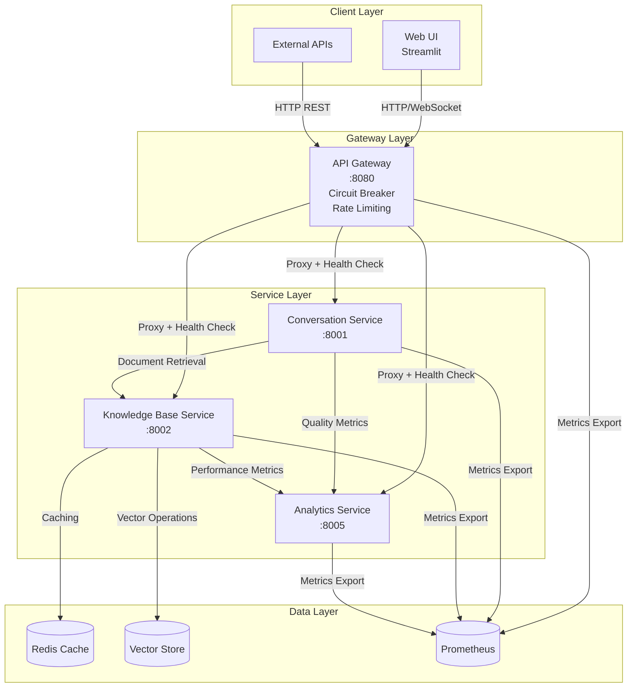
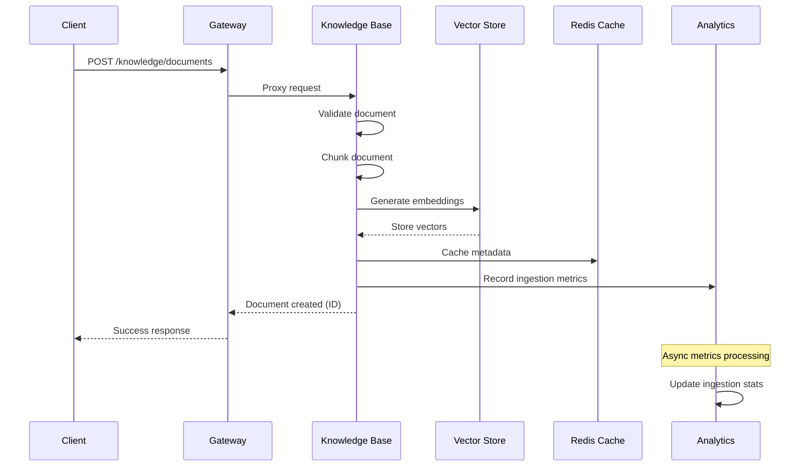
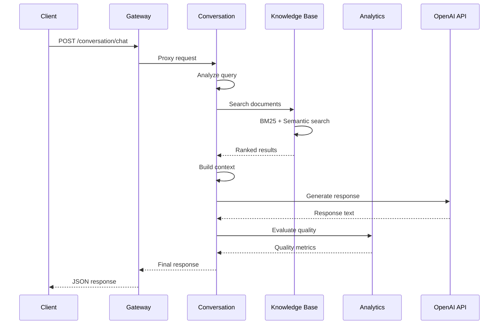
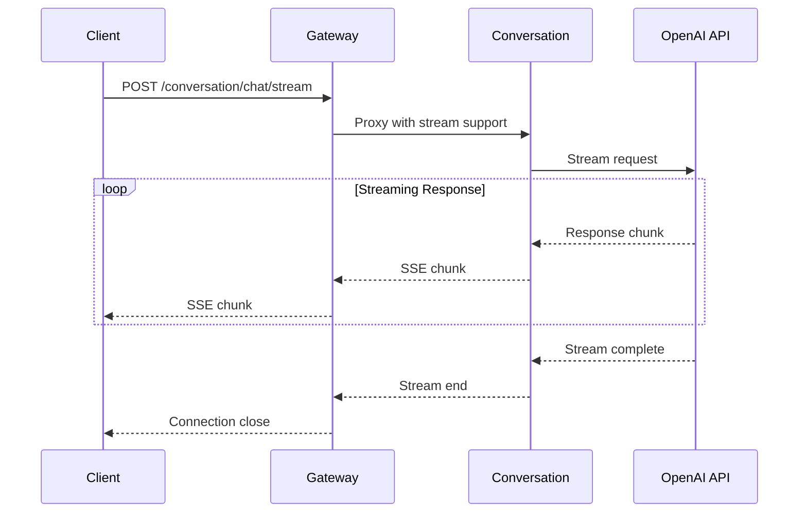

# Service Communication Patterns

## Overview

The LLM-Powered Retrieval System implements a sophisticated inter-service communication architecture using HTTP-based APIs with advanced patterns including circuit breakers, retry logic, and comprehensive monitoring. This document details how services communicate, data flows, and integration patterns.

## Communication Architecture



## Communication Patterns

### 1. Synchronous HTTP Communication

#### Request-Response Pattern
All inter-service communication uses HTTP/REST APIs with JSON payloads:

```python
# Standard service client pattern
class ServiceClient:
    def __init__(self, base_url: str, timeout: float = 30.0):
        self.base_url = base_url
        self.timeout = timeout
        self.client = httpx.AsyncClient(
            timeout=httpx.Timeout(timeout),
            headers={"Content-Type": "application/json"}
        )
    
    async def post(self, endpoint: str, data: dict, 
                   headers: dict = None) -> dict:
        try:
            response = await self.client.post(
                f"{self.base_url}{endpoint}",
                json=data,
                headers=headers or {}
            )
            response.raise_for_status()
            return response.json()
        except httpx.RequestError as e:
            raise ServiceCommunicationError(f"Request failed: {e}")
        except httpx.HTTPStatusError as e:
            raise ServiceHTTPError(f"HTTP {e.response.status_code}: {e.response.text}")
```

#### Async Client Implementation
```python
# services/conversation-service/src/core/service_clients.py
class KnowledgeBaseClient:
    def __init__(self, base_url: str):
        self.base_url = base_url
        self.client = httpx.AsyncClient(timeout=30.0)
    
    async def search_documents(self, query: str, limit: int = 10) -> List[dict]:
        """Search for relevant documents"""
        response = await self.client.get(
            f"{self.base_url}/api/v1/search",
            params={"query": query, "limit": limit}
        )
        response.raise_for_status()
        return response.json()["results"]
    
    async def get_document(self, document_id: str) -> dict:
        """Retrieve specific document"""
        response = await self.client.get(
            f"{self.base_url}/api/v1/documents/{document_id}"
        )
        response.raise_for_status()
        return response.json()
```

### 2. API Gateway Proxy Pattern

#### Enhanced Proxy Logic
The API Gateway implements intelligent request routing with fault tolerance:

```python
# services/api-gateway/src/main.py:45
async def proxy_request(service_url: str, path: str, request: Request) -> Response:
    """Enhanced proxy with circuit breaker and retry logic"""
    
    # Check circuit breaker state
    if not await circuit_breaker.is_service_available(service_url):
        raise HTTPException(503, "Service temporarily unavailable")
    
    # Add correlation ID for request tracing
    headers = dict(request.headers)
    if "x-correlation-id" not in headers:
        headers["x-correlation-id"] = str(uuid.uuid4())
    
    # Retry logic with exponential backoff
    retry_attempts = 3
    backoff_factor = 1.5
    
    for attempt in range(retry_attempts):
        try:
            start_time = time.time()
            
            response = await httpx_client.request(
                method=request.method,
                url=f"{service_url}/{path}",
                headers=headers,
                content=await request.body(),
                params=dict(request.query_params),
                timeout=httpx.Timeout(30.0)
            )
            
            # Record success metrics
            response_time = time.time() - start_time
            await record_proxy_metrics(service_url, response.status_code, response_time)
            
            return Response(
                content=response.content,
                status_code=response.status_code,
                headers=dict(response.headers)
            )
            
        except httpx.TimeoutException:
            if attempt == retry_attempts - 1:
                await circuit_breaker.record_failure(service_url)
                raise HTTPException(504, "Service timeout")
            await asyncio.sleep(backoff_factor ** attempt)
            
        except httpx.ConnectError:
            await circuit_breaker.record_failure(service_url)
            raise HTTPException(502, "Service unavailable")
```

#### Circuit Breaker Implementation
```python
class CircuitBreaker:
    def __init__(self, failure_threshold: int = 5, timeout: int = 60):
        self.failure_threshold = failure_threshold
        self.timeout = timeout
        self.failure_counts = {}
        self.last_failure_times = {}
        self.circuit_states = {}  # "closed", "open", "half-open"
    
    async def is_service_available(self, service_url: str) -> bool:
        state = self.circuit_states.get(service_url, "closed")
        
        if state == "closed":
            return True
        elif state == "open":
            # Check if timeout period has passed
            last_failure = self.last_failure_times.get(service_url, 0)
            if time.time() - last_failure > self.timeout:
                self.circuit_states[service_url] = "half-open"
                return True
            return False
        else:  # half-open
            return True
    
    async def record_success(self, service_url: str):
        self.failure_counts[service_url] = 0
        self.circuit_states[service_url] = "closed"
    
    async def record_failure(self, service_url: str):
        self.failure_counts[service_url] = self.failure_counts.get(service_url, 0) + 1
        self.last_failure_times[service_url] = time.time()
        
        if self.failure_counts[service_url] >= self.failure_threshold:
            self.circuit_states[service_url] = "open"
```

### 3. Health Check Communication

#### Service Health Monitoring
```python
# API Gateway health monitoring system
class HealthMonitor:
    def __init__(self, services: dict, check_interval: int = 30):
        self.services = services  # {"service_name": "service_url"}
        self.check_interval = check_interval
        self.health_status = {}
        self.last_check_times = {}
    
    async def start_monitoring(self):
        """Start periodic health checks"""
        while True:
            await asyncio.gather(*[
                self.check_service_health(name, url)
                for name, url in self.services.items()
            ])
            await asyncio.sleep(self.check_interval)
    
    async def check_service_health(self, service_name: str, service_url: str):
        """Check individual service health"""
        try:
            start_time = time.time()
            async with httpx.AsyncClient(timeout=10.0) as client:
                response = await client.get(f"{service_url}/health")
                response_time = time.time() - start_time
                
            self.health_status[service_name] = {
                "healthy": response.status_code == 200,
                "response_time": response_time,
                "last_check": datetime.utcnow().isoformat(),
                "status_code": response.status_code
            }
            
        except Exception as e:
            self.health_status[service_name] = {
                "healthy": False,
                "error": str(e),
                "last_check": datetime.utcnow().isoformat()
            }
```

#### Health Check Endpoints
Each service implements standardized health checks:

```python
# Standard health check implementation
@router.get("/health")
async def health_check():
    """Liveness probe - service is running"""
    return {
        "status": "healthy",
        "service": service_name,
        "version": version,
        "timestamp": datetime.utcnow().isoformat()
    }

@router.get("/ready")
async def readiness_check():
    """Readiness probe - service dependencies are available"""
    checks = {}
    
    # Check database connection
    try:
        await database.execute("SELECT 1")
        checks["database"] = {"status": "healthy"}
    except Exception as e:
        checks["database"] = {"status": "unhealthy", "error": str(e)}
    
    # Check external service dependencies
    if hasattr(config, 'external_services'):
        for service_name, service_url in config.external_services.items():
            try:
                async with httpx.AsyncClient(timeout=5.0) as client:
                    response = await client.get(f"{service_url}/health")
                    checks[service_name] = {
                        "status": "healthy" if response.status_code == 200 else "unhealthy",
                        "response_code": response.status_code
                    }
            except Exception as e:
                checks[service_name] = {"status": "unhealthy", "error": str(e)}
    
    # Determine overall readiness
    all_healthy = all(check.get("status") == "healthy" for check in checks.values())
    
    if all_healthy:
        return {"status": "ready", "checks": checks}
    else:
        raise HTTPException(503, {"status": "not_ready", "checks": checks})
```

## Data Flow Patterns

### 1. Document Ingestion Flow



**Implementation**:
```python
# services/knowledge-base-service/src/api/routes.py:45
@router.post("/documents")
async def create_document(document: DocumentCreateRequest):
    try:
        # 1. Validate and process document
        document_id = str(uuid.uuid4())
        chunks = await document_chunker.chunk_document(
            document.content, 
            chunk_size=1000, 
            overlap=200
        )
        
        # 2. Generate and store embeddings (async)
        embedding_task = asyncio.create_task(
            vector_store.store_document_embeddings(document_id, chunks)
        )
        
        # 3. Cache document metadata
        await cache_manager.set(
            f"doc:{document_id}",
            {
                "title": document.title,
                "category": document.category,
                "tags": document.tags,
                "created_at": datetime.utcnow().isoformat()
            },
            ttl=3600
        )
        
        # 4. Record metrics (fire-and-forget)
        asyncio.create_task(
            analytics_client.record_document_ingestion(
                document_id, len(chunks), document.category
            )
        )
        
        # 5. Wait for embeddings to complete
        await embedding_task
        
        return {"id": document_id, "chunks_created": len(chunks)}
        
    except Exception as e:
        await analytics_client.record_error("document_ingestion", str(e))
        raise HTTPException(500, f"Document creation failed: {str(e)}")
```

### 2. Query Processing Flow



**Implementation**:
```python
# services/conversation-service/src/core/adaptive_rag_pipeline.py:85
async def process_query(self, query: str, conversation_id: str) -> RAGResponse:
    start_time = time.time()
    
    try:
        # 1. Analyze query
        query_analysis = await self.query_processor.analyze_query(query)
        
        # 2. Retrieve relevant documents
        retrieval_params = self._determine_retrieval_strategy(query_analysis)
        documents = await self.knowledge_base_client.search_documents(
            query=query,
            limit=retrieval_params["max_documents"],
            search_type=retrieval_params["search_type"]
        )
        
        # 3. Build context from conversation history
        context = await self.context_manager.build_context(
            query, conversation_id, query_analysis
        )
        
        # 4. Generate response
        response_text = await self.llm_client.generate_response(
            query=query,
            context=context.primary_context,
            documents=documents,
            temperature=retrieval_params.get("temperature", 0.7)
        )
        
        # 5. Evaluate response quality (async)
        quality_task = asyncio.create_task(
            self.analytics_client.evaluate_response(
                query=query,
                context=context.primary_context,
                response=response_text,
                conversation_id=conversation_id
            )
        )
        
        processing_time = time.time() - start_time
        
        # 6. Build response object
        rag_response = RAGResponse(
            response=response_text,
            processing_time=processing_time,
            confidence_score=self._calculate_confidence(documents, query_analysis),
            query_analysis=query_analysis,
            contextual_info=context,
            sources=[{
                "id": doc["id"],
                "title": doc["title"],
                "score": doc["score"]
            } for doc in documents[:5]],
            metadata={
                "model_used": "gpt-4",
                "document_count": len(documents),
                "retrieval_strategy": retrieval_params["search_type"]
            }
        )
        
        # 7. Wait for quality evaluation
        quality_metrics = await quality_task
        rag_response.quality_metrics = quality_metrics
        
        return rag_response
        
    except Exception as e:
        # Record error metrics
        await self.analytics_client.record_error(
            "query_processing", str(e), conversation_id
        )
        raise ProcessingError(f"Query processing failed: {str(e)}")
```

### 3. Streaming Response Flow



**Implementation**:
```python
# services/conversation-service/src/api/routes.py:65
@router.post("/chat/stream")
async def stream_conversation(request: StreamingConversationRequest):
    """Stream conversation response using Server-Sent Events"""
    
    async def generate_response():
        try:
            # Initialize streaming response
            yield f"data: {json.dumps({'type': 'start', 'conversation_id': request.conversation_id})}\n\n"
            
            # Process query and get document context
            documents = await knowledge_base_client.search_documents(
                request.message, limit=10
            )
            
            # Stream response from LLM
            response_chunks = []
            async for chunk in llm_client.stream_generate_response(
                query=request.message,
                documents=documents,
                conversation_id=request.conversation_id
            ):
                response_chunks.append(chunk)
                
                # Send chunk to client
                yield f"data: {json.dumps({'type': 'chunk', 'content': chunk})}\n\n"
            
            # Send completion message
            full_response = ''.join(response_chunks)
            completion_data = {
                "type": "complete",
                "response": full_response,
                "metadata": {
                    "document_count": len(documents),
                    "processing_time": time.time() - start_time
                }
            }
            yield f"data: {json.dumps(completion_data)}\n\n"
            
        except Exception as e:
            error_data = {"type": "error", "message": str(e)}
            yield f"data: {json.dumps(error_data)}\n\n"
    
    return StreamingResponse(
        generate_response(),
        media_type="text/event-stream",
        headers={
            "Cache-Control": "no-cache",
            "Connection": "keep-alive"
        }
    )
```

## Error Handling and Resilience

### 1. Service-Level Error Handling

```python
class ServiceError(Exception):
    """Base service error"""
    def __init__(self, message: str, service: str, status_code: int = 500):
        self.message = message
        self.service = service
        self.status_code = status_code
        super().__init__(message)

class ServiceCommunicationError(ServiceError):
    """Communication failure between services"""
    pass

class ServiceTimeoutError(ServiceCommunicationError):
    """Service request timeout"""
    pass

# Global error handler
@app.exception_handler(ServiceError)
async def service_error_handler(request: Request, exc: ServiceError):
    # Log error with context
    logger.error(
        "Service error occurred",
        service=exc.service,
        error=exc.message,
        status_code=exc.status_code,
        request_id=request.headers.get("x-correlation-id")
    )
    
    # Record error metrics
    error_counter.labels(
        service=exc.service,
        error_type=type(exc).__name__
    ).inc()
    
    return JSONResponse(
        status_code=exc.status_code,
        content={
            "error": exc.message,
            "service": exc.service,
            "request_id": request.headers.get("x-correlation-id"),
            "timestamp": datetime.utcnow().isoformat()
        }
    )
```

### 2. Retry Logic with Exponential Backoff

```python
from tenacity import retry, stop_after_attempt, wait_exponential, retry_if_exception_type

class ServiceClient:
    @retry(
        stop=stop_after_attempt(3),
        wait=wait_exponential(multiplier=1, min=1, max=10),
        retry=retry_if_exception_type((httpx.TimeoutException, httpx.ConnectError))
    )
    async def _make_request(self, method: str, url: str, **kwargs):
        """Make HTTP request with retry logic"""
        async with httpx.AsyncClient() as client:
            response = await client.request(method, url, **kwargs)
            response.raise_for_status()
            return response.json()
```

### 3. Graceful Degradation

```python
# services/conversation-service/src/core/adaptive_rag_pipeline.py:150
async def process_query_with_fallback(self, query: str, conversation_id: str) -> RAGResponse:
    """Process query with graceful degradation"""
    
    try:
        # Primary processing pipeline
        return await self.process_query(query, conversation_id)
        
    except ServiceCommunicationError as e:
        if "knowledge-base" in str(e):
            # Fallback: Use cached documents or simplified search
            logger.warning("Knowledge base unavailable, using fallback")
            return await self._process_with_fallback_retrieval(query, conversation_id)
        else:
            raise
    
    except ServiceTimeoutError:
        # Fallback: Return quick response with limited context
        logger.warning("Service timeout, returning quick response")
        return await self._generate_quick_response(query, conversation_id)

async def _process_with_fallback_retrieval(self, query: str, conversation_id: str) -> RAGResponse:
    """Fallback processing with cached or simplified retrieval"""
    
    # Use local cache or simple keyword matching
    cached_documents = await self.local_cache.search(query)
    
    if not cached_documents:
        # Ultimate fallback: knowledge-free response
        return await self._generate_knowledge_free_response(query)
    
    # Process with limited context
    return await self._generate_response_from_cache(query, cached_documents, conversation_id)
```

## Rate Limiting and Throttling

### 1. API Gateway Rate Limiting

```python
from slowapi import Limiter, _rate_limit_exceeded_handler
from slowapi.util import get_remote_address

limiter = Limiter(key_func=get_remote_address)

@app.middleware("http")
async def rate_limit_middleware(request: Request, call_next):
    """Global rate limiting middleware"""
    
    # Different limits for different endpoints
    if request.url.path.startswith("/conversation"):
        # Conversation endpoints: 60 requests per minute
        limit = "60/minute"
    elif request.url.path.startswith("/knowledge"):
        # Knowledge base endpoints: 100 requests per minute
        limit = "100/minute"
    else:
        # Other endpoints: 200 requests per minute
        limit = "200/minute"
    
    # Apply rate limit
    try:
        await limiter.check_request_limit(request, limit)
    except Exception:
        return JSONResponse(
            status_code=429,
            content={"error": "Rate limit exceeded", "retry_after": 60}
        )
    
    response = await call_next(request)
    return response
```

### 2. Service-Level Throttling

```python
import asyncio
from asyncio import Semaphore

class ThrottledClient:
    def __init__(self, max_concurrent: int = 10, rate_per_second: int = 5):
        self.semaphore = Semaphore(max_concurrent)
        self.rate_per_second = rate_per_second
        self.last_request_time = 0
    
    async def throttled_request(self, method: str, url: str, **kwargs):
        """Make throttled request to prevent overwhelming downstream services"""
        
        async with self.semaphore:
            # Rate limiting
            now = time.time()
            time_since_last = now - self.last_request_time
            min_interval = 1.0 / self.rate_per_second
            
            if time_since_last < min_interval:
                await asyncio.sleep(min_interval - time_since_last)
            
            self.last_request_time = time.time()
            
            # Make request
            return await self._make_request(method, url, **kwargs)
```

## Monitoring and Observability

### 1. Distributed Tracing

```python
import uuid
from contextvars import ContextVar

# Context variable for correlation ID
correlation_id: ContextVar[str] = ContextVar('correlation_id')

@app.middleware("http")
async def tracing_middleware(request: Request, call_next):
    """Add correlation ID to all requests"""
    
    # Get or generate correlation ID
    trace_id = request.headers.get("x-correlation-id") or str(uuid.uuid4())
    correlation_id.set(trace_id)
    
    # Add to request for downstream services
    request.state.correlation_id = trace_id
    
    response = await call_next(request)
    
    # Add to response headers
    response.headers["x-correlation-id"] = trace_id
    
    return response

# Service client with correlation ID propagation
class TracedServiceClient:
    async def post(self, endpoint: str, data: dict) -> dict:
        headers = {}
        
        # Propagate correlation ID
        try:
            trace_id = correlation_id.get()
            headers["x-correlation-id"] = trace_id
        except LookupError:
            pass
        
        return await self._make_request("POST", endpoint, json=data, headers=headers)
```

### 2. Metrics Collection

```python
from prometheus_client import Counter, Histogram, Gauge

# Service communication metrics
inter_service_requests = Counter(
    'inter_service_requests_total',
    'Total inter-service requests',
    ['source_service', 'target_service', 'method', 'status']
)

inter_service_duration = Histogram(
    'inter_service_request_duration_seconds',
    'Inter-service request duration',
    ['source_service', 'target_service', 'method']
)

active_connections = Gauge(
    'active_service_connections',
    'Number of active connections between services',
    ['source_service', 'target_service']
)

# Metrics collection in service client
class InstrumentedServiceClient:
    def __init__(self, service_name: str, target_service: str):
        self.service_name = service_name
        self.target_service = target_service
    
    async def post(self, endpoint: str, data: dict) -> dict:
        start_time = time.time()
        
        try:
            active_connections.labels(
                source_service=self.service_name,
                target_service=self.target_service
            ).inc()
            
            response = await self._make_request("POST", endpoint, json=data)
            
            # Record success metrics
            inter_service_requests.labels(
                source_service=self.service_name,
                target_service=self.target_service,
                method="POST",
                status="success"
            ).inc()
            
            return response
            
        except Exception as e:
            # Record failure metrics
            inter_service_requests.labels(
                source_service=self.service_name,
                target_service=self.target_service,
                method="POST",
                status="error"
            ).inc()
            raise
            
        finally:
            # Record duration and decrement active connections
            duration = time.time() - start_time
            inter_service_duration.labels(
                source_service=self.service_name,
                target_service=self.target_service,
                method="POST"
            ).observe(duration)
            
            active_connections.labels(
                source_service=self.service_name,
                target_service=self.target_service
            ).dec()
```

This comprehensive service communication architecture ensures reliable, monitored, and resilient inter-service communication while maintaining high performance and operational visibility.