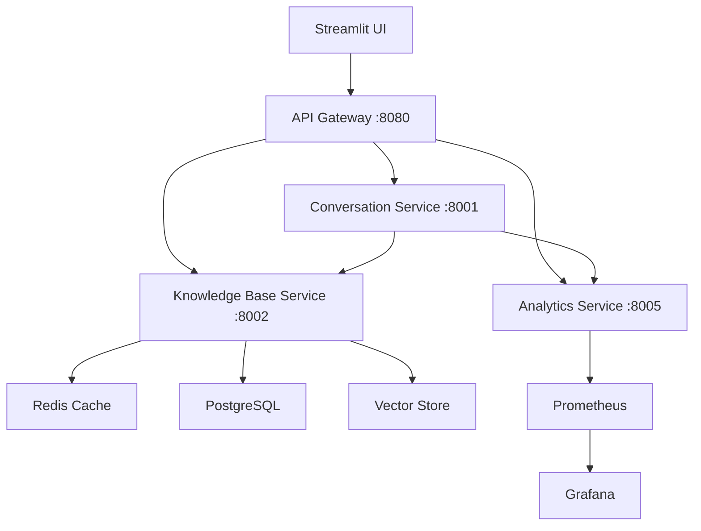

# LLM-Powered Retrieval System Documentation

## Overview

This is a comprehensive documentation suite for the LLM-Powered Retrieval System - a production-grade, microservices-based RAG (Retrieval-Augmented Generation) platform designed for intelligent document retrieval and response generation.

## Documentation Structure

### 📋 **Core Documentation**
- [**Architecture Overview**](./01-architecture-overview.md) - System design and microservices architecture
- [**Database Schemas**](./02-database-schemas.md) - Data models and database structure
- [**Services Documentation**](./03-services-documentation.md) - Individual service details and APIs

### 🔄 **Process Documentation**
- [**Document Ingestion Pipeline**](./04-document-ingestion.md) - How documents are processed and indexed
- [**RAG Implementation**](./05-rag-implementation.md) - Retrieval-Augmented Generation details
- [**Query Processing Flow**](./06-query-processing.md) - Request handling and processing pipeline
- [**Response Generation**](./07-response-generation.md) - Response creation and quality assurance

### 🚀 **Operational Documentation**
- [**Features & Capabilities**](./08-features-capabilities.md) - System features and functionality
- [**Service Communication**](./09-service-communication.md) - Inter-service communication patterns
- [**Deployment Guide**](./10-deployment-guide.md) - Installation and deployment instructions
- [**Monitoring & Analytics**](./11-monitoring-analytics.md) - Observability and metrics

### 🛠️ **Technical Reference**
- [**API Reference**](./12-api-reference.md) - Complete API documentation
- [**Configuration Guide**](./13-configuration.md) - System configuration options
- [**Troubleshooting**](./14-troubleshooting.md) - Common issues and solutions

## Quick Start

1. **System Overview**: Start with [Architecture Overview](./01-architecture-overview.md)
2. **Understanding Data**: Review [Database Schemas](./02-database-schemas.md)
3. **Core Services**: Explore [Services Documentation](./03-services-documentation.md)
4. **RAG Pipeline**: Deep dive into [RAG Implementation](./05-rag-implementation.md)

## Key Features

- ✅ **Microservices Architecture** with Docker containerization
- ✅ **Advanced RAG Pipeline** with adaptive query strategies
- ✅ **Real-time Analytics** and quality monitoring
- ✅ **Production-ready** with Kubernetes deployment
- ✅ **Comprehensive API** with FastAPI framework
- ✅ **Vector Database Integration** (Pinecone, FAISS, ChromaDB)
- ✅ **Enterprise Security** with rate limiting and authentication

## Technology Stack

- **Backend**: FastAPI, Python 3.9+
- **AI/ML**: LangChain, OpenAI GPT-4, Sentence Transformers
- **Databases**: PostgreSQL, Redis, Vector Stores (Pinecone/FAISS)
- **Infrastructure**: Docker, Kubernetes, Prometheus, Grafana
- **Frontend**: Streamlit (Demo UI)

## Architecture Overview

## Getting Started

For deployment instructions, see [Deployment Guide](./10-deployment-guide.md).

For API usage, refer to [API Reference](./12-api-reference.md).

---

**Last Updated**: July 2025  
**Version**: 1.0  
**Maintainer**: Development Team